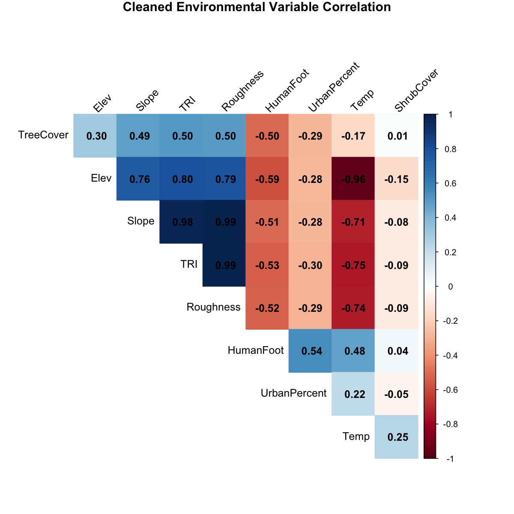
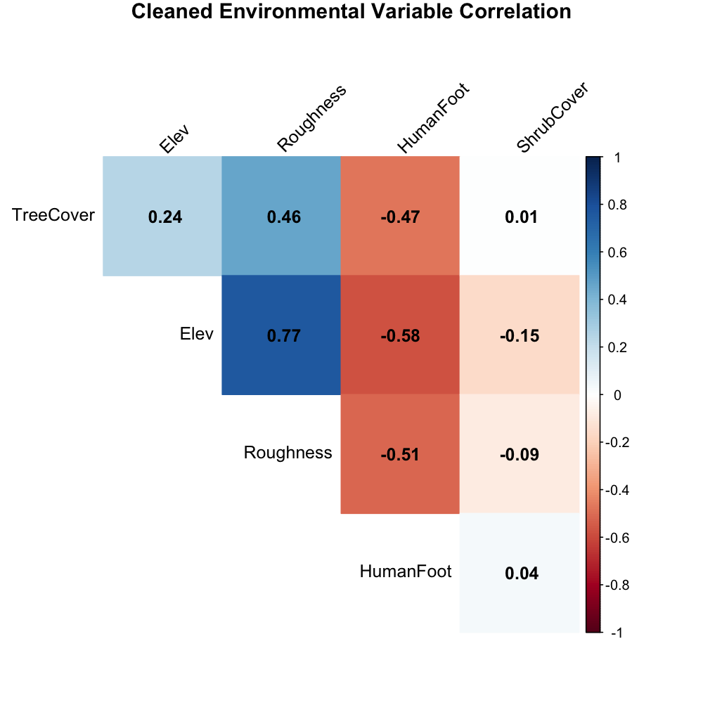
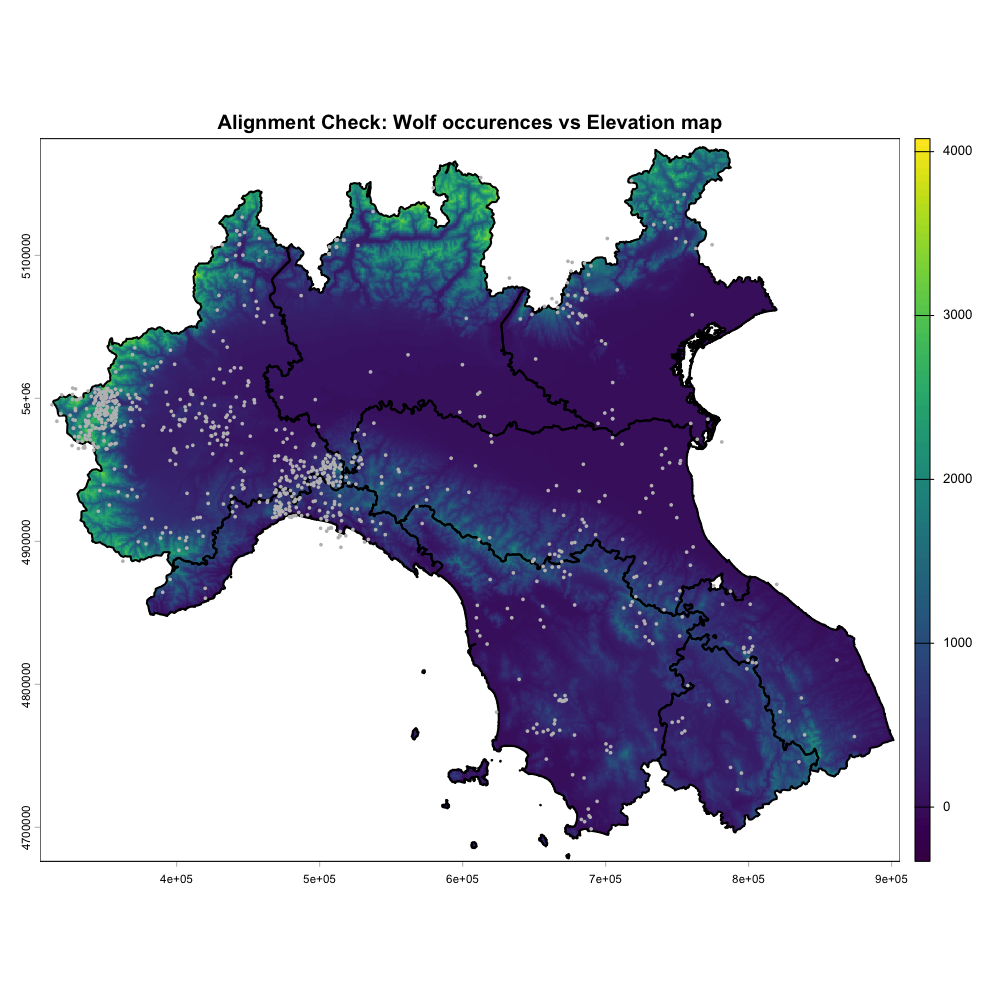
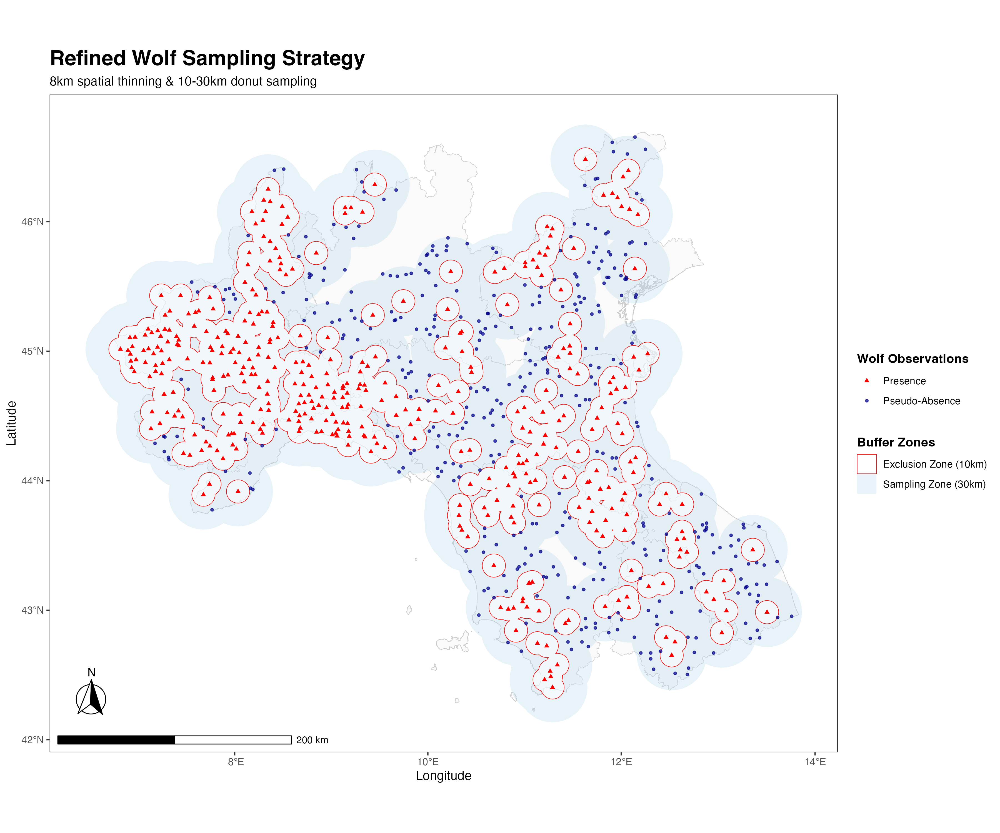
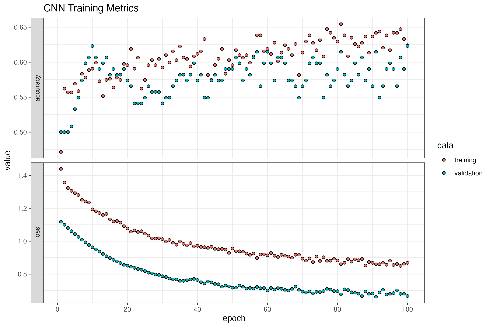

## 1. Project Initialization and Dependency Management

The first step in any spatial deep learning workflow is establishing a clean environment. This involves setting the working directory to ensure file paths remain consistent and loading a specific suite of libraries designed to handle the complex transition from **geographic rasters** to **neural network tensors**.

### Core Components:

* **Spatial Engine**: `terra` and `sf` handle the heavy lifting for raster and vector processing.
* **Data Acquisition**: `geodata`, `elevatr`, and `rgbif` allow for programmatic access to administrative, topographic, and biodiversity databases.
* **Deep Learning**: `keras3` provides the interface to TensorFlow, while `abind` is used to restructure spatial patches into 4D tensors.
* **Cartography**: `ggplot2`, `tidyterra`, and `ggspatial` ensure that model outputs are visualized with professional map elements (scale bars, north arrows).

```r
# --- 1. SETUP & ENVIRONMENT ---

# Set the working directory to the project folder
setwd("/Users/jonahmende/Library/Mobile Documents/com~apple~CloudDocs/Unibo/3. semestre/spatial ecology in r")

# Define the required packages for spatial analysis, data acquisition, and Deep Learning
libs <- c(
  "geodata",      # For administrative boundaries and climate data
  "elevatr",      # Access to global elevation datasets
  "terra",        # Primary engine for raster data manipulation
  "sf",           # Handling of vector (shapefile) data
  "rgbif",        # Interface for Global Biodiversity Information Facility
  "caret",        # Machine learning tools for data splitting
  "keras3",       # Interface for TensorFlow/CNN modeling
  "corrplot",     # Visualizing variable correlations
  "dplyr",        # Data manipulation and piping
  "abind",        # Combining multi-dimensional arrays (tensors)
  "ggplot2",      # Core plotting library
  "tidyterra",    # Integration of terra objects with ggplot2
  "ggspatial",    # Adding scale bars and north arrows to maps
  "pROC",         # Evaluating model performance via ROC/AUC
  "imageRy"       # Specialized remote sensing visualization
)

# Load all libraries; character.only ensures the list is read correctly
lapply(libs, require, character.only = TRUE)

# Create a dedicated directory for storing downloaded spatial layers
dir.create("map_data", showWarnings = FALSE)


```

## 2. Defining the Study Area: Administrative Boundaries

Once the environment is ready, we define the geographic scope of our analysis. Using the **Global Administrative Areas (GADM)** database, we isolate the specific regions of Italy that form the core of our study.

Instead of modeling the entire peninsula, this script focuses on the **Northern and Central regions**. These areas are characterized by the rugged Apennine and Alpine terrains—habitats where wolf populations have seen significant recovery. By casting the data into a `MULTIPOLYGON` format via the `sf` package, we ensure the geometry is clean and compatible with subsequent spatial clipping and extraction tasks.

```r
# --- 2. ADMINISTRATIVE BOUNDARIES & STUDY AREA ---

# Download Italy's administrative boundaries (Level 1 = Regions)
italy <- gadm(country = "ITA", level = 1, path = "map_data")

# Filter for specific northern and central regions where wolf presence is significant
regions <- italy[italy$NAME_1 %in% c("Emilia-Romagna", "Toscana", "Lombardia", 
                                     "Veneto", "Piemonte", "Trento", "Umbria", 
                                     "Marche", "Liguria"), ]

# Cast to MULTIPOLYGON for broader compatibility with 'sf' and 'terra' functions
# This step ensures geometry consistency for spatial operations
target_sf <- st_as_sf(regions) %>% st_cast("MULTIPOLYGON")


```

## 3. Topographic Foundation: Elevation Data

The first environmental predictor for our model is a **Digital Elevation Model (DEM)**. Elevation is a critical factor for wolf habitat selection, as it often correlates with prey availability, snow cover, and distance from human disturbance.

We use the `elevatr` package to programmatically retrieve terrain data. A zoom level of **z = 7** is chosen to balance detail with computational efficiency, providing a resolution suitable for national-scale habitat modeling. After retrieval, the raw raster is transformed into a `SpatRaster` object, then meticulously **cropped** and **masked** to match the precise borders of our target Italian regions. This ensures that our model only considers data within the actual study area.

```r
# --- 3. ELEVATION DATA & SPATIAL TEMPLATE ---

# Retrieve Digital Elevation Model (DEM) data via 'elevatr'
# z = 7 provides an appropriate resolution for national-scale modeling (approx. 600m-1km)
elevation_raw <- get_elev_raster(target_sf, z = 7, clip = "bbox")

# Convert to SpatRaster, crop to the study area extent, and mask to the region borders
# Masking ensures values outside the administrative boundaries are set to NA
elevation <- rast(elevation_raw) %>% 
  crop(regions) %>% 
  mask(regions)

# Assign a clean name for the model's feature engineering phase
names(elevation) <- "Elev"

```

## 4. Geographic Fidelity: Pixel Dimension Analysis

When working with geographic coordinate systems (WGS84, EPSG:4326), units are expressed in **decimal degrees** rather than meters. However, because the Earth is an ellipsoid, the physical distance of one degree of longitude shrinks as you move from the equator toward the poles.

Before proceeding with spatial modeling, it is vital to understand the **real-world footprint** of our data. In this step, we calculate the physical dimensions of a single pixel at the center of our study area (latitude ~43°N). This verification confirms that each pixel represents roughly **389m x 532m**. Understanding this "rectangularity" is crucial when the CNN looks at a 32x32 patch, as it tells us the model is analyzing an area of approximately **12.5km x 17km**.

```r
# --- 4. PIXEL DIMENSION ANALYSIS (GEOGRAPHIC VS PROJECTED) ---

# Because geographic coordinates (lat/lon) represent distance differently 
# depending on latitude, we verify the physical size of a pixel in meters.
deg_res <- res(elevation) 
center_lat <- 43.0
center_lon <- 12.0

# Create points to measure East-West and North-South distance of one pixel
# This identifies the "real-world" resolution of our grid
p_start <- vect(matrix(c(center_lon, center_lat), ncol=2), crs="EPSG:4326")
p_east  <- vect(matrix(c(center_lon + deg_res[1], center_lat), ncol=2), crs="EPSG:4326")
p_north <- vect(matrix(c(center_lon, center_lat + deg_res[2]), ncol=2), crs="EPSG:4326")

pixel_width  <- distance(p_start, p_east)
pixel_height <- distance(p_start, p_north)

# Print results to the console for verification
cat("--- Raw Pixel Analysis (WGS84) ---\n")
# Output: --- Raw Pixel Analysis (WGS84) ---
cat("Width: ", round(pixel_width), "m | Height: ", round(pixel_height), "m\n")
# Output: Width: 389 m | Height: 532 m

```


## 5. Spatial Standardization: UTM Projection

For deep learning models like CNNs, the geometry of the input data is as important as the values themselves. In the previous step, we discovered that our raw pixels were rectangular (**389m x 532m**). If fed directly into a CNN, the model would perceive a "stretched" version of the landscape, potentially misinterpreting slopes and spatial patterns.

To correct this, we project the elevation data into **UTM Zone 32N (EPSG:32632)**. This coordinate reference system uses meters instead of degrees, allowing us to enforce a perfectly square pixel resolution of **500m x 500m**. This standardization ensures that a 3x3 convolutional kernel covers the exact same physical area regardless of where it slides across the map of Italy.

```r
# --- 5. STANDARDIZATION & PROJECTION ---

# PROJECTING TO UTM ZONE 32N: This is critical for CNNs. 
# It converts the grid to square pixels (500m x 500m), ensuring spatial consistency.
# This prevents the CNN from perceiving a "stretched" version of the terrain.
elevation <- project(elevation, "EPSG:32632", res = 500)

# Re-mask the projected raster to the projected region borders
# This cleans up the edges after the coordinate transformation
elevation <- mask(elevation, project(regions, "EPSG:32632"))

```


## 6. Multi-Source Environmental Data Acquisition

A robust Habitat Suitability Model requires more than just topography; it needs a multi-dimensional view of the ecosystem. In this stage, we programmatically pull data from several global repositories to build a comprehensive set of predictors.

By using the `elevation` raster as a spatial template (via `ext(elevation)`), we ensure that all incoming layers—ranging from climate to human impact—are immediately cropped to our specific study area in Italy.

### The Predictor Suite:

* **Climate (`Temp`)**: Sourced from WorldClim, representing Annual Mean Temperature.
* **Human Impact (`Footprint`)**: The Global Human Footprint index, measuring the cumulative toll of infrastructure, population density, and industry.
* **Land Cover (`Trees`, `Shrubs`, `Urban`, `Grass`)**: High-resolution layers defining the physical vegetation and built environment, which influence both wolf concealment and prey distribution.

```r
# --- 6. ENVIRONMENTAL VARIABLE ACQUISITION ---

# Use the existing elevation raster to define the spatial extent for all other variables
study_area <- ext(elevation)

# Download and crop bioclimatic and landcover variables
# We store them in a list for organized processing in the next steps
raw_list <- list(
  Temp      = crop(worldclim_country("ITA", var = "bio", path = "map_data")[[1]], study_area),
  Footprint = crop(footprint(year = 2009, path = "map_data"), study_area),
  Trees     = crop(landcover(var = "trees", path = "map_data"), study_area),
  Shrubs    = crop(landcover(var = "shrubs", path = "map_data"), study_area),
  Urban     = crop(landcover(var = "built", path = "map_data"), study_area),
  Grass     = crop(landcover(var = "grassland", path = "map_data"), study_area)
)

```

## 7. Advanced Terrain Modeling: Derivatives & Focal Analysis

To a wolf, the landscape is defined by more than just altitude; it is defined by the **complexity** of the terrain. Steeper slopes offer vantage points and protection, while high ruggedness provides cover and denning sites.

In this section, we derive three standard metrics from our DEM: **Slope**, **Topographic Position Index (TPI)**, and the **Terrain Ruggedness Index (TRI)**. Additionally, we use a custom focal analysis function (a "kernel") to calculate the local standard deviation of elevation—a precise measure of **Roughness**. By sliding a  moving window across the map, the model can identify areas where the terrain changes abruptly, capturing the fine-scale "texture" of the Italian mountains.

```r
# --- 7. TERRAIN DERIVATIVES & CUSTOM KERNEL ---

# Calculate standard terrain metrics using the 'terra' engine
slope     <- terrain(elevation, v = "slope", unit = "degrees")
tpi       <- terrain(elevation, v = "TPI")
tri       <- terrain(elevation, v = "TRI") # Terrain Ruggedness Index

# ImageRy KERNEL FUNCTION: 
# This function applies a moving window (focal analysis) to a raster.
# It summarizes the neighborhood of each pixel using statistical metrics 
# (mean, sd, etc.) to highlight local spatial patterns.

im.kernel <- function(input_image, mw = 3,
                      stat = c("mean", "median", "sd", "var", "cv", "range")) {
  
  if (!inherits(input_image, "SpatRaster")) {
    stop("input_image should be a SpatRaster object.")
  }
  if (terra::nlyr(input_image) != 1) {
    stop("input_image must have a single layer (nlyr == 1).")
  }
  
  if (!inherits(mw, "numeric") || length(mw) != 1 || is.na(mw)) {
    stop("mw must be a single numeric value.")
  }
  mw <- as.integer(mw)
  if (mw < 1 || (mw %% 2) == 0) {
    stop("mw must be a positive odd integer (e.g., 3, 5, 7, ...).")
  }
  
  stat <- match.arg(
    stat,
    choices = c("mean", "median", "sd", "var", "cv", "range"),
    several.ok = TRUE
  )
  
  fun_range <- function(v) {
    if (all(is.na(v))) return(NA_real_)
    rng <- range(v, na.rm = TRUE)
    rng[2] - rng[1]
  }
  
  fun_cv <- function(v) {
    if (all(is.na(v))) return(NA_real_)
    m <- mean(v, na.rm = TRUE)
    if (is.na(m) || m == 0) return(NA_real_)
    stats::sd(v, na.rm = TRUE) / m
  }
  
  out <- list()
  
  if ("mean" %in% stat) {
    out[["mean"]] <- terra::focal(input_image, w = mw, fun = mean, na.rm = TRUE)
  }
  if ("median" %in% stat) {
    out[["median"]] <- terra::focal(input_image, w = mw, fun = stats::median, na.rm = TRUE)
  }
  if ("sd" %in% stat) {
    out[["sd"]] <- terra::focal(input_image, w = mw, fun = stats::sd, na.rm = TRUE)
  }
  if ("var" %in% stat) {
    out[["var"]] <- terra::focal(input_image, w = mw, fun = stats::var, na.rm = TRUE)
  }
  if ("cv" %in% stat) {
    out[["cv"]] <- terra::focal(input_image, w = mw, fun = fun_cv)
  }
  if ("range" %in% stat) {
    out[["range"]] <- terra::focal(input_image, w = mw, fun = fun_range)
  }
  
  res <- terra::rast(out)
  names(res) <- names(out)
  terra::plot(res)
  invisible(res)
}

# Apply the kernel to derive Roughness (Standard Deviation of elevation in a 3x3 window)
# This provides a fine-grained look at terrain variability
roughness <- im.kernel(elevation, mw = 3, stat = "sd")

```


## 8. Multi-Layer Stack Alignment & Harmonization

In the world of spatial modeling, "garbage in, garbage out" often stems from misaligned data. Because our environmental variables originate from different sources (WorldClim, Global Human Footprint, and ESA Land Cover), they arrive with different resolutions, coordinate systems, and extents.

This section is the "harmonization" phase. We use the **500m UTM elevation grid** as the gold standard. Every other layer—from temperature to tree cover—is projected and resampled using **bilinear interpolation** to match this exact grid. Finally, we bundle these layers into a single `SpatRaster` object: the **Environmental Stack**. This stack acts as the multi-channel "image" that our CNN will eventually "see."

```r
# --- 8. MULTI-LAYER STACK ALIGNMENT ---

# Update regional vector to match the projected coordinate system (UTM Zone 32N)
regions_utm <- project(regions, crs(elevation))

# Project and Resample all external layers to match the 500m UTM elevation grid
# 'method = bilinear' is used for continuous variables like temperature and footprint
processed_list <- lapply(raw_list, function(l) {
  l_utm <- project(l, elevation, method = "bilinear")
  l_masked <- mask(l_utm, regions_utm)
  return(l_masked)
})

# Assemble the final environmental stack
# This combines topography, climate, human impact, and land cover into one object
env_stack_og <- c(
  elevation, 
  slope, 
  tpi,
  tri,
  roughness,
  processed_list$Temp, 
  processed_list$Footprint, 
  processed_list$Trees,
  processed_list$Shrubs,
  processed_list$Urban
)

# Rename layers for clear identification during feature importance analysis
names(env_stack_og) <- c("Elev", "Slope", "TPI", "TRI", "Roughness", "Temp", 
                         "HumanFoot", "TreeCover", "ShrubCover", "UrbanPercent")

```


## 9. Spatial Visualization & Quality Assurance

Before committing the data to the deep learning model, it is essential to visualize the entire environmental stack. This step serves as a final quality control check, ensuring that all layers are correctly aligned, masked to the Italian study area, and free of spatial artifacts.

We export this visualization as a high-resolution multi-panel plot. By using the `viridis` color palette, we ensure that the environmental gradients—from the high altitudes of the Alps to the density of the human footprint—are easily distinguishable and perceptually uniform. The final output provides a comprehensive "geographic atlas" of the 10 predictors that will inform our wolf habitat suitability analysis.

```r
# --- 9. VISUALIZATION & EXPORT ---

# 1. Save the Multi-panel plot to a high-resolution PNG
# The large dimensions (2000x2000) allow for detailed inspection of each layer
png("Environmental_Stack_Multipanel.png", width = 2000, height = 2000, res = 180)

# We leave 'main' empty so 'terra' uses the individual layer names for each frame
# 'nc = 3' organizes the 10 layers into a 3-column grid
plot(env_stack_og, 
     nc = 3, 
     col = viridis::viridis(100), 
     mar = c(3, 3, 4, 4)) # Adjusted margins for the 'Super Title'

# Add one single "Super Title" at the top of the entire PNG file
mtext("Environmental Covariates Stack (500m UTM)", 
      side = 3, line = -1.5, outer = TRUE, cex = 1.5, font = 2)

dev.off()

# 2. Re-plot in the R console to verify the data within the active session
plot(env_stack_og, nc = 3, col = viridis::viridis(100))

```


## 10. Feature Selection & Min-Max Normalization

In deep learning, data preparation is as critical as model architecture. In this stage, we refine our predictor set and normalize the data to ensure stable training.

### Variable Selection

We begin by subsetting our stack to remove the **Topographic Position Index (TPI)**. At our current 500m resolution, TPI can often introduce noise rather than signal for a wide-ranging predator like the wolf. We retain the remaining nine variables—ranging from terrain complexity (Slope, TRI) to anthropogenic factors (Human Footprint, Urban Percent)—which provide a comprehensive ecological profile.

### The Scaling Process

Neural networks are highly sensitive to the scale of input data. For instance, **Elevation** values can reach 3,000 meters, while **Tree Cover** is a percentage (0–100). If left unscaled, the model would unfairly prioritize variables with larger numerical ranges. We apply **Min-Max Scaling**, which compresses every pixel value into a standard range of . This ensures that every environmental factor contributes equally to the initial weight calculations of the CNN.

```r
# --- 10. VARIABLE SELECTION & MIN-MAX SCALING ---

# Drop TPI (Topographic Position Index) due to poor resolution at this scale
# We keep only variables with high ecological relevance for wolf presence
env_stack <- subset(env_stack_og, c("Elev", "Slope", "TRI", "Roughness", "Temp", 
                                    "HumanFoot", "TreeCover", "ShrubCover", "UrbanPercent"))

# CNNs perform best when data is within a standard range (0 to 1)
# 1. Calculate the global minimum and maximum for each layer in the stack
env_min <- minmax(env_stack)[1,]
env_max <- minmax(env_stack)[2,]

# 2. Apply the Scaling Formula: (Value - Min) / (Max - Min)
# This transformation is performed per-layer across the entire spatial extent
env_scaled <- (env_stack - env_min) / (env_max - env_min)

# WARNING: there are still NaN values in env_scaled


```

## 11. Collinearity Analysis & Variable Pruning

In ecological modeling, many environmental variables are naturally redundant. For example, **Elevation** and **Temperature** often share a strong negative correlation (the higher the altitude, the lower the temperature). Including highly correlated variables—a problem known as **multi-collinearity**—can confuse the model, leading to unstable weight assignments and overfitting.

To address this, we statistically analyze the relationships between our predictors. By randomly sampling 10,000 pixels across Italy, we generate a correlation matrix to identify redundant layers.

### Initial Correlation Check

Our first pass reveals the high degree of overlap between several terrain and climate metrics.


```r
# --- 11. COLLINEARITY ANALYSIS ---

# 1. Randomly sample 10,000 pixels to calculate correlations
# Sampling is faster than using the entire raster for statistical checks
set.seed(123) # Ensures reproducibility
sample_data <- spatSample(env_scaled, size = 10000, method = "random", na.rm = TRUE)

# 2. Generate and Save the Initial Correlation Matrix
cor_matrix <- cor(sample_data)

png("Correlation_Heatmap_Initial.png", width = 1200, height = 1200, res = 150)
corrplot(cor_matrix, 
         method = "color", 
         type = "upper", 
         order = "hclust", 
         addCoef.col = "black", 
         tl.col = "black", 
         tl.srt = 45, 
         diag = FALSE,
         title = "Initial Correlation Matrix",
         mar = c(0,0,1,0))
dev.off()

```


### Optimized Predictor Set

To create a leaner, more robust model, we prune the stack to five core, distinct predictors:

1. **Elevation** (Topographic baseline)
2. **Roughness** (Fine-scale terrain complexity)
3. **Human Footprint** (Anthropogenic pressure)
4. **Tree Cover** (Vegetation/Shelter)
5. **Shrub Cover** (Alternative concealment)

By verifying the final matrix, we ensure that the remaining variables provide unique information to the CNN, reducing noise and improving generalization.

```r
# 3. Drop Redundant Variables
# To prevent model overfitting and multi-collinearity issues (e.g., Elev vs Temp),
# we retain a core set of distinct environmental predictors.
env_scaled <- subset(env_scaled, c("Elev", "Roughness", "HumanFoot", "TreeCover", "ShrubCover"))

# 4. Verify the Cleaned Stack Correlation
cor_matrix_new <- cor(spatSample(env_scaled, size = 10000, na.rm = TRUE))

png("Correlation_Heatmap_Final.png", width = 1000, height = 1000, res = 150)
corrplot(cor_matrix_new, 
         method = "color", 
         type = "upper", 
         order = "hclust", 
         addCoef.col = "black", 
         tl.col = "black", 
         tl.srt = 45, 
         diag = FALSE,
         title = "Final Optimized Predictors",
         mar = c(0,0,1,0))
dev.off()

```



## 12. Environmental Covariate Exploration: Density & Distribution

Before feeding the data into the Convolutional Neural Network, it is vital to inspect the **distribution density** of our scaled predictors. While all variables have been compressed into a  range, their "shapes" differ significantly. Some may follow a normal distribution, while others, like **Human Footprint** or **Urban Percent**, are often heavily skewed toward zero in wilderness areas.

Using a ridgeline plot, we can visualize the probability density of each variable across the entire study area. This helps us identify potential data imbalances or outliers that might influence how the CNN weights different environmental features. A wide distribution suggests a variable with high contrast across Italy, while a narrow peak indicates a more uniform environmental condition.


```r
# --- 12. ENVIRONMENTAL COVARIATE EXPLORATION ---

# im.ridgeline generates a ggplot object showing data distribution
# This allows us to see the 'signature' of each environmental layer
ridge_plot <- im.ridgeline(env_scaled, scale = 1.5, palette = "viridis") +
  labs(
    title = "Distribution Density of Scaled Environmental Variables",
    subtitle = "Standardized [0-1] range for CNN Input",
    x = "Scaled Value",
    y = "Variable"
  ) +
  theme_minimal()

# Display the plot in the R console
print(ridge_plot)

# Save the plot using ggsave (recommended for imageRy/ggplot outputs)
# High DPI ensures the density curves are smooth and legible
ggsave("Environmental_Ridgelines.png", plot = ridge_plot, width = 8, height = 6, dpi = 300)

```


## 13. Species Data Acquisition: Sourcing Wolf Occurrences

With the environmental predictors finalized, we now introduce the biological data. We utilize the **Global Biodiversity Information Facility (GBIF)** via the `rgbif` package to retrieve georeferenced records of *Canis lupus* (Grey Wolf) within our study regions.

This step involves fetching coordinates for up to 5,000 observations. To ensure spatial consistency, the raw geographic coordinates (latitude/longitude) are converted into a `SpatVector` and reprojected to **UTM Zone 32N**. This aligns our species "presence" points perfectly with the pixel grid of our environmental stack, a prerequisite for extracting the local habitat characteristics that the CNN will learn to recognize.

```r
# --- 13. SPECIES DATA ACQUISITION (GBIF) ---

# Fetch occurrence data for Canis lupus in specified Italian regions
# We filter for records with coordinates to ensure they can be mapped
wolf_obs <- occ_data(scientificName = "Canis lupus", hasCoordinate = TRUE, limit = 5000, 
                     country = "IT", stateProvince = c("Emilia-Romagna", "Toscana", "Lombardia", 
                                                       "Veneto", "Piemonte", "Trento", "Umbria", 
                                                       "Marche", "Liguria"))

# Combine results from multiple regions into a single unified data frame
pres_pts <- bind_rows(lapply(wolf_obs, function(x) x$data)) 

# Convert to SpatVector and project to match the environmental stack (UTM Zone 32N)
# This ensures that biological points and environmental rasters share the same coordinate space
pres_vect <- vect(pres_pts, geom=c("decimalLongitude", "decimalLatitude"), crs="EPSG:4326")
pres_vect <- project(pres_vect, crs(env_scaled))

# Visualize the alignment
png("wolf_alignment_map.png", width = 1000, height = 1000, res = 100)
plot(elevation[[1]], main = "Alignment Check: Wolf occurences vs Elevation map")
plot(regions, add = TRUE, border = "black", lwd = 2) # Administrative borders
plot(pres_vect, add = TRUE, col = "grey", cex = 0.5) # Wolf sightings
dev.off()

```



## 14. Data Cleaning & Spatial Thinning

Raw occurrence data from GBIF often contains spatial biases. For example, wolves might be reported more frequently near hiking trails, roads, or densely populated areas simply because there are more humans there to see them. If we train our model on these "clusters," the CNN might mistakenly learn that wolves prefer being near humans.

To solve this, we perform **Spatial Thinning**. We overlay an 8km grid across our study area and select only one observation per cell. This process ensures a more even geographic distribution, forcing the model to learn the broad environmental characteristics of the habitat rather than the specific locations of popular observation hotspots.

```r
# --- 14. DATA CLEANING & SPATIAL THINNING ---

# 1. Remove points that fall outside the environmental raster (NA check)
# This ensures we don't try to train on points located in the sea or outside our regions
extracted_vals <- terra::extract(env_scaled[[1]], pres_vect)
pres_vect_clean <- pres_vect[which(!is.na(extracted_vals[, 2])), ]


# 2. Spatial Thinning (8km grid)
# This prevents model bias toward over-sampled areas (e.g., near roads/cities)
# By setting res to 8000, we create 8km x 8km blocks
thinning_grid <- rast(env_scaled)
res(thinning_grid) <- 8000  

# We sample 1 point per 8km strata to homogenize the presence data
set.seed(123)
pres_final <- spatSample(pres_vect_clean, method = "random", strata = thinning_grid, size = 1)

```

## 15. Pseudo-Absence Generation (Donut Sampling)

To train a binary classifier (Presence vs. Absence), we need "absence" data. Since GBIF only provides sightings (**presences**), we must generate **pseudo-absences** (background points).

We use a **"Donut Sampling"** strategy to ensure high-quality data:

* **Inner Exclusion Zone (10km):** We don't pick absences too close to known presences. If a wolf was seen at point A, it’s highly likely the habitat 1km away is also suitable. Sampling an "absence" there would confuse the model.
* **Outer Sampling Universe (30km):** We don't pick absences from the other side of the continent. By sampling within 30km, we force the model to learn the *subtle* differences between where a wolf is and where it isn't within the same general region.

```r
# --- 15. PSEUDO-ABSENCE GENERATION (DONUT SAMPLING) ---

# 1. Create Buffer Zones (10km exclusion, 30km sampling universe)
# Aggregating prevents the code from processing hundreds of individual circles
pres_buffer_inner <- aggregate(buffer(pres_final, width = 10000)) 
pres_buffer_outer <- aggregate(buffer(pres_final, width = 30000)) 

# 2. Filter "Safe" cells for sampling (avoiding raster edges)
# This ensures that when we later crop 33x33 pixel squares around a point, 
# we don't hit the edge of the map.
cells_with_data <- as.data.frame(env_scaled[[1]], xy = TRUE, na.rm = TRUE, cells = TRUE)
rc <- rowColFromCell(env_scaled, cells_with_data$cell)
valid_indices <- which(rc[,1] > 16 & rc[,1] < (nrow(env_scaled) - 16) & 
                       rc[,2] > 16 & rc[,2] < (ncol(env_scaled) - 16))
cells_safe_vect <- vect(cells_with_data[valid_indices, ], geom=c("x", "y"), crs=crs(env_scaled))

# 3. Apply Donut Logic: Points must be inside 30km but outside 10km of a presence
inside_outer <- is.related(cells_safe_vect, pres_buffer_outer, "intersects")
inside_inner <- is.related(cells_safe_vect, pres_buffer_inner, "intersects")
abs_coords <- as.data.frame(cells_safe_vect[inside_outer & !inside_inner, ], geom="XY")

# 4. Balanced Sampling: Match number of absences to number of presences
# A 1:1 ratio prevents the model from becoming biased toward one class.
set.seed(123)
abs_final <- vect(abs_coords[sample(nrow(abs_coords), nrow(pres_final)), ], 
                  geom=c("x", "y"), crs = crs(env_scaled))

```

## 16. Dataset Stratification: Training, Validation, and Testing

To evaluate our CNN's performance honestly, we must ensure it doesn't "cheat" by seeing the test data during its learning phase. This requires a rigorous **Stratified Split**. Unlike a simple random split, stratification ensures that the ratio of wolf presences (1) to absences (0) remains identical across all three subsets.

We divide our data into three distinct "chapters":

* **Training (70%):** The data the model uses to adjust its internal weights and learn what wolf habitat looks like.
* **Validation (15%):** A "practice exam" used during training to tune hyperparameters and prevent overfitting.
* **Testing (15%):** The final, unseen "final exam" used to calculate the model's true accuracy.

```r
# --- 16. DATASET STRATIFICATION (TRAIN/VAL/TEST) ---

# Combine and label: Presence = 1, Absence = 0
# 'all_pts' now contains our balanced dataset for supervised learning
pres_final$label <- 1
abs_final$label <- 0
all_pts <- rbind(pres_final[, "label"], abs_final[, "label"])

# Function for 70/15/15 Stratified Split
# This ensures that each split has the same proportion of presence/absence points
get_stratified_splits <- function(idx_vector) {
  set.seed(42) # For reproducibility
  shuffled_idx <- sample(idx_vector)
  n <- length(shuffled_idx)
  train_end <- round(0.70 * n)
  val_end   <- round(0.85 * n)
  return(list(train = shuffled_idx[1:train_end], 
              val = shuffled_idx[(train_end + 1):val_end], 
              test = shuffled_idx[(val_end + 1):n]))
}

# Apply split logic to presences and absences separately
pres_split <- get_stratified_splits(which(all_pts$label == 1))
abs_split  <- get_stratified_splits(which(all_pts$label == 0))

# Map the split labels back to the master point dataset
all_pts$split <- NA
all_pts$split[c(pres_split$train, abs_split$train)] <- "train"
all_pts$split[c(pres_split$val, abs_split$val)]     <- "val"
all_pts$split[c(pres_split$test, abs_split$test)]   <- "test"

```


## 17. CNN Tile Extraction: 4D Array Preparation

This is the bridge between Geographic Information Systems (GIS) and Deep Learning. Standard ecological models usually look at a single pixel's value; a **Convolutional Neural Network (CNN)**, however, looks at a "neighborhood."

For every wolf occurrence and pseudo-absence point, we extract a ** pixel patch** (roughly  of real-world terrain). This transforms our data into a **4D Array (Tensor)** with the following dimensions:


By looking at these "habitat images," the model can learn complex spatial textures—like how wolves might prefer a specific mix of steep slopes and high tree cover that is far from human infrastructure.

```r
# --- 17. CNN TILE EXTRACTION (4D ARRAY PREP) ---

# This function loops through our points and "cuts out" a square image from the raster stack
extract_split_tiles <- function(pts_vector, split_label, stack, patch_size = 32) {
  subset_pts <- pts_vector[pts_vector$split == split_label, ]
  coords <- crds(subset_pts)
  labels <- subset_pts$label
  n_pts <- nrow(subset_pts)
  n_layers <- nlyr(stack)
  
  # Initialize an empty 4D array: [Sample, Row, Col, Channel]
  tiles <- array(0, dim = c(n_pts, patch_size, patch_size, n_layers))
  
  for(i in 1:n_pts) {
    # Locate the central pixel for the current observation
    cell <- cellFromXY(stack, coords[i, , drop=FALSE])
    rc   <- rowColFromCell(stack, cell)
    
    # Define a 32x32 window (15 pixels back, 16 forward)
    rows <- (rc[1]-15):(rc[1]+16)
    cols <- (rc[2]-15):(rc[2]+16)
    
    try({
      # Extract values for all environmental layers
      patch_vals <- stack[rows, cols, 1:n_layers]
      tiles[i,,,] <- array(as.matrix(patch_vals), dim = c(patch_size, patch_size, n_layers))
    }, silent = TRUE)
  }
  
  # Clean up missing data (NAs become 0, which is the scaled minimum)
  tiles[is.na(tiles)] <- 0
  return(list(x = tiles, y = as.numeric(labels)))
}

# Create final tensors for the model
# These are now ready to be fed directly into a Keras/TensorFlow or Torch model
train_data <- extract_split_tiles(all_pts, "train", env_scaled)
val_data   <- extract_split_tiles(all_pts, "val", env_scaled)
test_data  <- extract_split_tiles(all_pts, "test", env_scaled)

```


## 18. Visualization of Sampling Strategy

Before moving to the modeling phase, we must visualize the spatial logic of our dataset. This map confirms that our data preparation was successful across three critical dimensions:

1. **Spatial Thinning:** The wolf presence points (red triangles) are evenly distributed, preventing the model from being biased toward over-sampled areas.
2. **The Donut Logic:** The blue "sampling zones" show the 30km radius where the model looks for environmental contrasts. The red-bordered "exclusion zones" (10km) act as a buffer, ensuring our pseudo-absences are far enough from known sightings to be reliable indicators of potentially less suitable habitat.
3. **Regional Coverage:** The sampling effectively covers the diverse landscapes of Northern and Central Italy, from the high Alps to the Apennine ridges.


```r
# --- 18. VISUALIZATION OF SAMPLING STRATEGY ---

# Create a comprehensive ggplot map of the study area and sampling design
wolf_sampling_plot <- ggplot() +
  # Draw the regional boundaries of Italy
  geom_spatvector(data = regions, fill = "gray98", color = "gray80") +
  
  # Visualize the 30km outer sampling universe
  geom_spatvector(data = pres_buffer_outer, aes(fill = "Sampling Zone (30km)"), alpha = 0.3, color = NA) +
  
  # Visualize the 10km inner exclusion buffer
  geom_spatvector(data = pres_buffer_inner, aes(fill = "Exclusion Zone (10km)"), 
                  fill = "white", alpha = 0.5, color = "red", linewidth = 0.2) +
  
  # Plot the final thinned presence and pseudo-absence points
  geom_spatvector(data = abs_final, aes(color = "Pseudo-Absence"), size = 0.8, alpha = 0.7) +
  geom_spatvector(data = pres_final, aes(color = "Presence"), size = 1.2, shape = 17) +
  
  # Formatting scales and legends
  scale_fill_manual(name = "Buffer Zones", values = c("Sampling Zone (30km)" = "lightblue")) +
  scale_color_manual(name = "Wolf Observations", values = c("Presence" = "red", "Pseudo-Absence" = "darkblue")) +
  
  # Add spatial context: Scale bar and North arrow
  annotation_scale(location = "bl", width_hint = 0.4) +
  annotation_north_arrow(location = "bl", which_north = "true", 
                         pad_x = unit(0.2, "in"), pad_y = unit(0.4, "in"), 
                         style = north_arrow_fancy_orienteering) +
  theme_bw() + 
  labs(title = "Refined Wolf Sampling Strategy", 
       subtitle = "8km spatial thinning & 10-30km donut sampling")

# Save high-res output for the GitHub repository
ggsave("Wolf_Sampling_Map_Final.png", plot = wolf_sampling_plot, width = 12, height = 10, dpi = 300)

```




## 19. CNN Architecture: Designing the Habitat "Brain"

We are now building the **Convolutional Neural Network (CNN)**. Unlike traditional models that look at individual pixels in isolation, this architecture is designed to "see" spatial patterns and textures within the 16km x 16km patches we extracted.

### The Architecture Breakdown

* **Data Augmentation:** By randomly flipping and rotating the tiles, we effectively double our training data and teach the model that a "north-facing slope" and a "south-facing slope" can both be suitable habitats.
* **Convolutional Blocks:** These act as filters. The first block identifies simple shapes (steep gradients, flat plains), while the second detects complex ecological signatures (forest fragmentation, proximity of urban centers to shrubland).
* **Global Average Pooling (GAP):** Instead of flattening the data into a massive list of numbers, GAP simplifies each feature map into a single average. This drastically reduces the number of parameters, making the model faster and less likely to memorize (overfit) the training sites.
* **Sigmoid Output:** The final layer produces a value between **0 and 1**, representing the probability of wolf presence.

```r
# --- 19. CNN ARCHITECTURE DEFINITION ---

# Input: 32x32 image patches with 5 channels (Elev, Roughness, HumanFoot, Tree, Shrub)
input <- layer_input(shape = c(32, 32, 5))

output <- input %>%
  # 1. Augmentation: Teaching the model that direction doesn't change habitat quality
  layer_random_flip("horizontal_and_vertical") %>%
  layer_random_rotation(factor = 0.1) %>% 
  
  # 2. Convolutional Block 1: Broad feature detection (edges, slopes)
  layer_conv_2d(filters = 8, kernel_size = c(3,3), activation = 'relu', padding = "same") %>%
  layer_batch_normalization() %>%
  layer_max_pooling_2d(pool_size = c(2,2)) %>%
  
  # 3. Convolutional Block 2: Complex patterns (fragmentation, forest density)
  layer_conv_2d(filters = 16, kernel_size = c(3,3), activation = 'relu', padding = "same") %>%
  layer_batch_normalization() %>%
  layer_max_pooling_2d(pool_size = c(2,2)) %>%
  
  # 4. Feature Condensing: Global Average Pooling reduces overfitting risk
  layer_global_average_pooling_2d() %>%
  
  # 5. Output Head: Binary classification (Wolf vs. No Wolf)
  layer_dense(units = 32, activation = 'relu', kernel_regularizer = regularizer_l2(0.02)) %>% 
  layer_dropout(rate = 0.5) %>% 
  layer_dense(units = 1, activation = 'sigmoid')

model <- keras_model(inputs = input, outputs = output)

# Compilation: Setting the 'rules' for learning
model %>% compile(
  optimizer = optimizer_adam(learning_rate = 0.0005),
  loss = 'binary_crossentropy',
  metrics = c('accuracy')
)

```

## 20. Model Training & Convergence

We now initiate the training process. During this phase, the CNN iteratively reviews our 3D habitat "patches" to minimize the difference between its predictions and the actual labels (Presence/Absence).

### Strategic Adjustments

* **Class Weighting:** We apply a weight of `2.0` to wolf presences. This tells the model that failing to identify a suitable wolf habitat (a "false negative") is twice as costly as misidentifying a poor habitat as good. This encourages the model to be more sensitive to rare ecological signals.
* **Early Stopping:** To prevent **overfitting** (where the model memorizes the training data but fails to generalize to new areas), we use a patience of 25 epochs. If the validation loss doesn't improve for 25 consecutive cycles, the training stops and restores the best version of the weights.
* **Metrics:** We monitor both **Loss** (how "wrong" the model is) and **Accuracy** (how often it's right) across both the training and validation sets.


```r
# --- 20. MODEL TRAINING ---

# Class Weights: Penalize missing a wolf more heavily than a false alarm
# This is useful for dealing with potential sampling bias in species records
weights <- list("0" = 1.0, "1" = 2.0)

history <- model %>% fit(
  x_train_rand, y_train_rand,
  epochs = 100,
  batch_size = 32,
  validation_data = list(x_val_rand, y_val_rand),
  class_weight = weights,
  # Early stopping prevents the model from training too long and losing generalizability
  callbacks = list(callback_early_stopping(patience = 25, restore_best_weights = TRUE)),
  verbose = 1
)

# Generate the plot with straight lines (smooth = FALSE)
# This allows us to see the exact fluctuations in performance per epoch
history_plot <- plot(history, smooth = FALSE) + 
  theme_bw() + 
  labs(title = "CNN Training Metrics",
       subtitle = "Accuracy and Loss per Epoch for Training vs. Validation")

# Display it in your R session
print(history_plot)

# Save it as a high-resolution image for your GitHub repository
ggsave("CNN_Training_History_Straight.png", 
       plot = history_plot, 
       width = 9, 
       height = 6, 
       dpi = 300)

# Results from Test Set
results <- model %>% evaluate(x_test_rand, y_test_rand)
print(results)

# Output:
# $accuracy [1] 0.625
# $loss [1] 0.6582897
```




