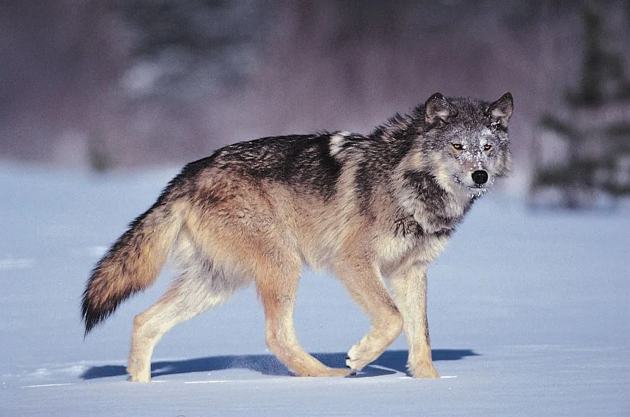
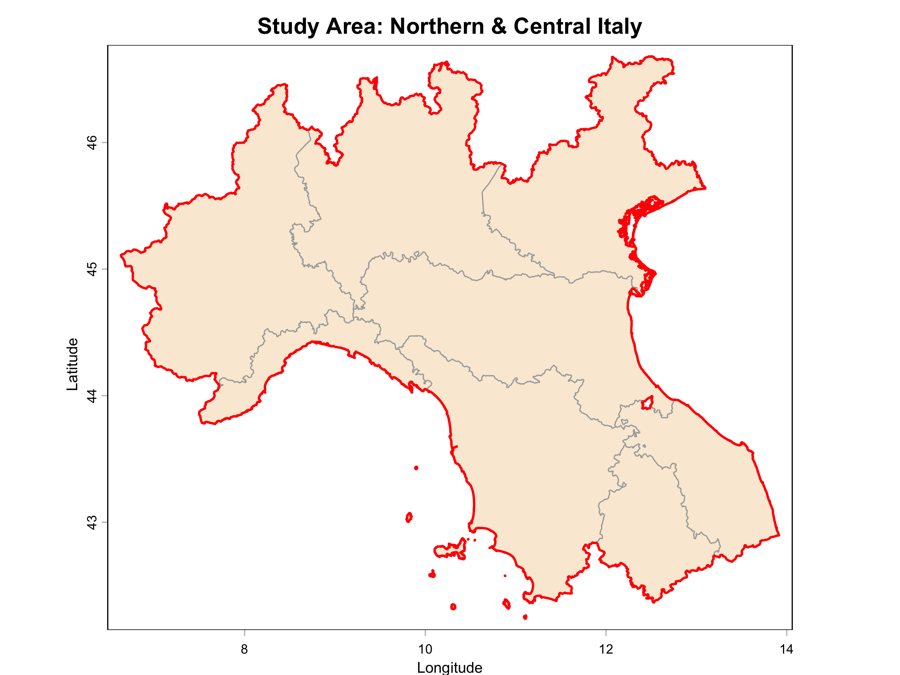
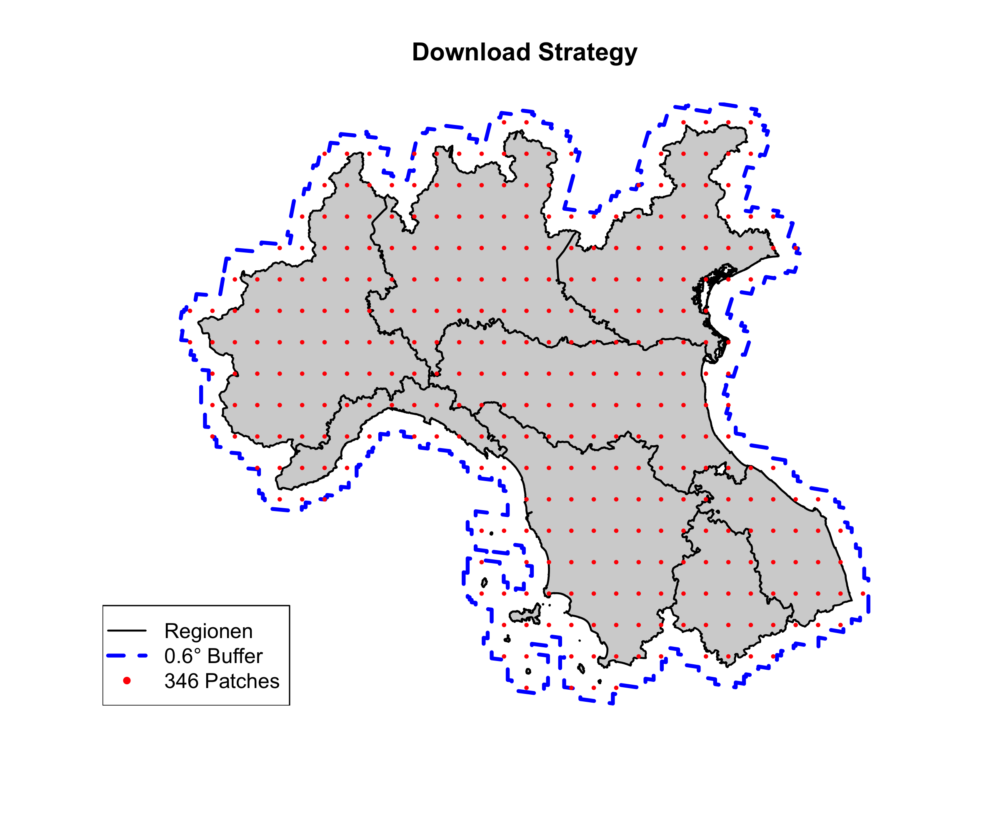
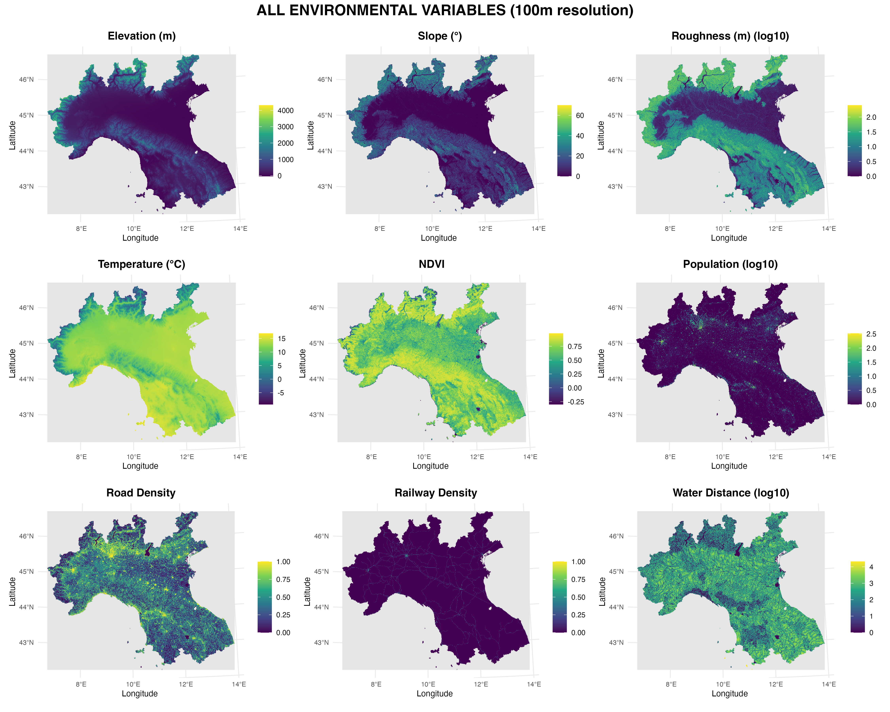
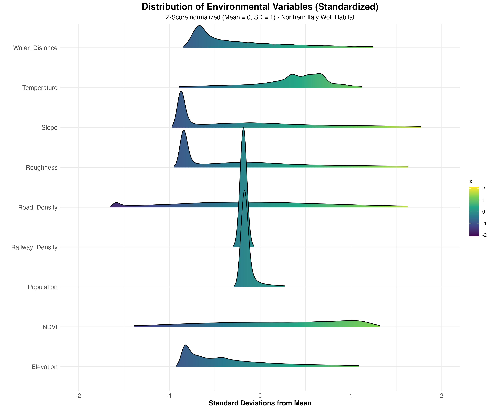
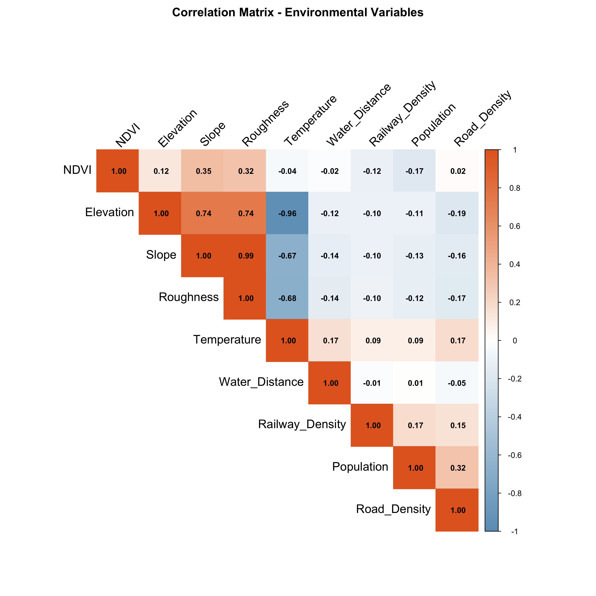
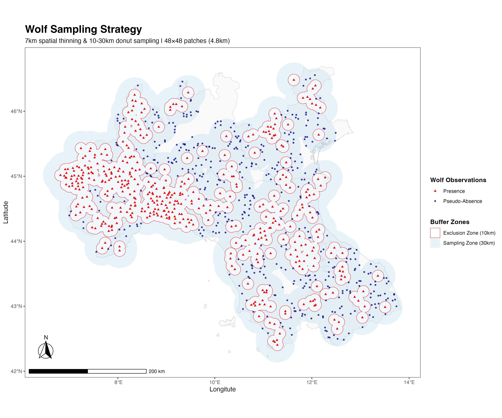
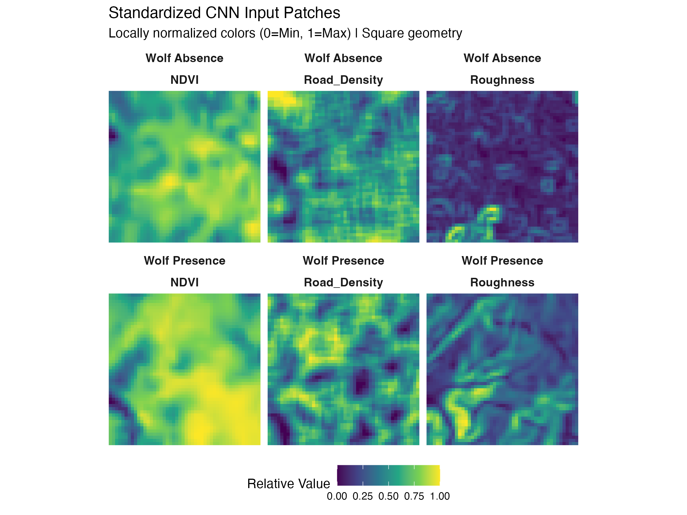
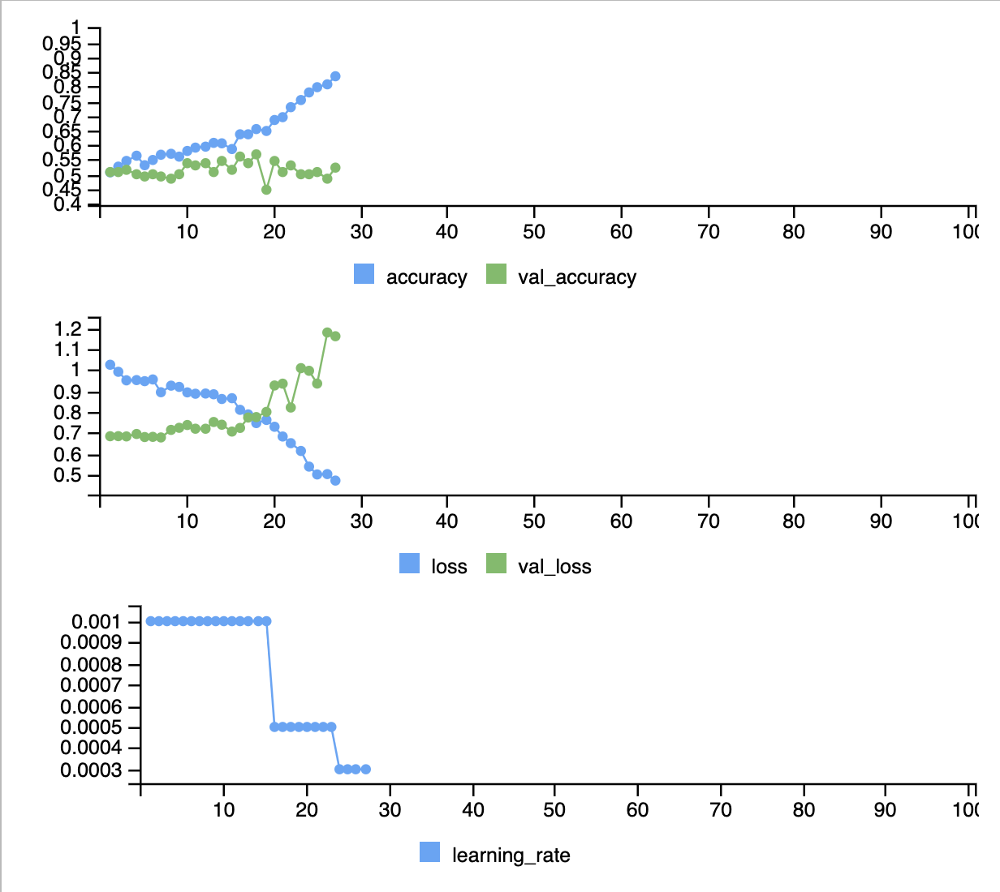

# Wolf Habitat Suitability Modeling in Northern Italy
**Author:** Jonah Mende  
**Course:** Spatial Ecology in R  
**Professor:** Prof. Duccio Rocchini




# Table of Contents
1. [Environmental Data Acquisition and Processing](#1-environmental-data-acquisition-and-processing)
    * [1.1 Study Area Definition](#11-study-area-definition)
    * [1.2 NDVI Acquisition (MODIS)](#12-ndvi-acquisition-modis)
    * [1.3 Elevation Data (SRTM)](#13-elevation-data-srtm)
    * [1.4 Terrain Derivatives](#14-terrain-derivatives)
    * [1.5 Climate Data (WorldClim)](#15-climate-data-worldclim)
    * [1.6 Human Footprint Variables](#16-human-footprint-variables)
        * [1.6.1 Road Density](#161-road-density)
        * [1.6.2 Railway Density](#162-railway-density)
        * [1.6.3 Population Density (GHS-POP)](#163-population-density-ghs-pop)
    * [1.7 Distance to Water](#17-distance-to-water)
    * [1.8 Variable Standardization and CNN Data Preparation](#18-variable-standardization-and-cnn-data-preparation)
    * [1.9 Correlation Analysis and Variable Selection](#19-correlation-analysis-and-variable-selection)
2. [Wolf Occurrence Data Acquisition and Processing](#2-wolf-occurrence-data-acquisition-and-processing)
    * [2.1 Aquisition (GBIF)](#21-aquisition-gbif)
    * [2.2 Spatial Thinning to Reduce Pseudoreplication](#22-spatial-thinning-to-reduce-pseudoreplication)
    * [2.3 Pseudo-Absence Sampling Strategy](#23-pseudo-absence-sampling-strategy)
    * [2.4 Train/Validation/Test Split (Stratified)](#24-trainvalidationtest-split-stratified)
3. [CNN Preparations and Modelling](#3-cnn-preparations-and-modelling)
    * [3.1 CNN Patch Extraction](#31-cnn-patch-extraction)
    * [3.2 CNN Model Architecture and Training](#32-cnn-model-architecture-and-training)
    * [3.3 Results and Evaluation](#33-results-and-evaluation)

---
# 1. Environmental Data Acquisition and Processing
## 1.1 Study Area Definition

### Setup and Libraries
```r
# Set working directory
setwd("/Users/jonahmende/Library/Mobile Documents/com~apple~CloudDocs/Unibo/3. semestre/spatial ecology in r/final")

# Load required libraries

libs <- c(
  "geodata",      # Download global spatial datasets (GADM boundaries, climate)
  "elevatr",      # Retrieve elevation data from various sources
  "terra",        # Modern raster/vector processing and spatial operations
  "sf",           # Simple Features for vector data and coordinate transformations
  "rgbif",        # Access GBIF database for species occurrence records
  "caret",        # Machine learning utilities (data splitting, cross-validation)
  "keras3",       # Deep learning framework for building and training CNNs
  "corrplot",     # Visualize correlation matrices with color-coded heatmaps
  "dplyr",        # Data wrangling and manipulation (filter, mutate, summarize)
  "abind",        # Combine multi-dimensional arrays (stack image patches)
  "ggplot2",      # Create publication-quality plots and maps
  "tidyterra",    # Make terra objects compatible with ggplot2
  "ggspatial",    # Add map elements to ggplot (scale bars, north arrows)
  "pROC",         # ROC curve analysis and AUC calculations for model evaluation
  "imageRy"       # Download and process satellite imagery (MODIS, Landsat)
)

lapply(libs, require, character.only = TRUE)  # takes vector or list and applies a function to each element one at a time

# Create directory for map data
dir.create("map_data", showWarnings = FALSE)
```

### Define Study Regions
```r
# Download administrative boundaries for Italy (GADM level 1 = regions) - Global Administrative Map
italy <- gadm(country = "ITA", level = 1, path = "map_data")

# Select 9 northern Italian regions relevant for wolf distribution
regions <- italy[italy$NAME_1 %in% c(
  "Emilia-Romagna", "Toscana", "Lombardia", 
  "Veneto", "Piemonte", "Trento", "Umbria", 
  "Marche", "Liguria"
), ]

# Project to UTM Zone 32N (EPSG:32632) for metric calculations
regions_utm <- project(regions, "EPSG:32632")

# Convert to sf object for spatial operations (to use before projection)
regions_sf <- st_as_sf(regions)

# Union all regions into single polygon
regions_union <- st_union(regions_sf)

# Open a file to save the plot
png("Study_Area_Italy.png", width = 2400, height = 1800, res = 300)

# Run your plot code exactly as before
plot(regions, 
     axes = TRUE, 
     main = "Study Area: Northern & Central Italy",
     xlab = "Longitude", 
     ylab = "Latitude",
     col = "antiquewhite",
     border = "darkgrey")

# Add the union outline on top (optional)
plot(regions_union, add = TRUE, border = "red", lwd = 2)

# Close the file
dev.off()

```

**Ecological Reasoning:**
- These 9 regions cover the core wolf range in the Northern Apennines
- UTM projection allows accurate distance and area calculations in meters and square grid cells

### Results


**Key characteristics:**
- Includes both Alpine and Apennine mountain ranges
- High habitat diversity: forests, grasslands, agricultural areas

---

## 1.2 NDVI Acquisition (MODIS)

### Create Download Grid with Buffer
```r
# Create 15km buffer around study area to avoid edge effects
# (15km = ~0.6° at this latitude, sufficient for MODIS processing)
regions_buffered <- st_buffer(regions_union, dist = 15000)

# Create grid of download points (0.25° spacing = ~27.5 km)
grid_points <- st_make_grid(
  regions_buffered, 
  cellsize = 0.25,  # Grid spacing in degrees
  what = "centers"   # Extract center points only
) %>% 
  st_as_sf()

# Filter points within buffered region
grid_points <- grid_points[
  st_intersects(grid_points, regions_buffered, sparse = FALSE), # returns FALSE and TRUE
]

# Create dataframe for MODISTools batch download
download_df <- data.frame(
  site_name = paste0("patch_", seq_len(nrow(grid_points))),
  lat = st_coordinates(grid_points)[, 2],
  lon = st_coordinates(grid_points)[, 1]
)

# Visualize download strategy
plot(st_geometry(regions_sf),        # strip away the attribute data and plot just the shapes/points
     main = "MODIS Download Grid", 
     lwd = 1.5, col = "lightgray", border = "black")  # line width
plot(st_geometry(regions_buffered), 
     add = TRUE, border = "blue", lty = 2, lwd = 3)   # line type
plot(st_geometry(grid_points), 
     add = TRUE, col = "red", pch = 20, cex = 0.5)    # point type and size
legend("bottomleft", 
       legend = c("Study Regions", "15km Buffer", 
                  paste(nrow(grid_points), "Download Points")),
       col = c("black", "blue", "red"),
       lty = c(1, 2, NA), lwd = c(1.5, 3, NA), pch = c(NA, NA, 20))
```

**Ecological Reasoning:**
- NDVI captures vegetation productivity, a proxy for prey availability
- June date captures peak vegetation season
- 250m resolution balances detail and computational feasibility

**Technical Details:**
- **Product:** MOD13Q1 (16-day composite, 250m)
- **Band:** 250m_16_days_NDVI
- **Date:** June 10, 2023 (peak growing season)
- **Patch size:** 17km × 17km per download point
- **Buffer:** 15km to ensure complete coverage
- **Grid spacing:** 0.25° (~27.5 km)

### Results


---

### Batch Download MODIS Data
```r
# Create directory for downloaded patches
dir.create("modis_patches", showWarnings = FALSE)

# Batch download using MODISTools
# Downloads 17×17 km patches centered on each grid point
mt_batch_subset(
  df = download_df,              # Grid points dataframe
  product = "MOD13Q1",           # MODIS Vegetation Indices product
  band = "250m_16_days_NDVI",    # NDVI band
  start = "2023-06-10",          # Single date (peak season)
  end = "2023-06-10",
  km_lr = 17,                    # 17 km left-right extent
  km_ab = 17,                    # 17 km above-below extent
  out_dir = "modis_patches",
  internal = FALSE               # Save as CSV files
)
```

### Process Downloaded Patches
```r
# Function to process individual MODIS patches
# Converts CSV to raster in MODIS Sinusoidal projection
process_patch_sinusoidal <- function(file) {
  tryCatch({        # if anything goes wrong with a particular file, it returns NULL and moves on
    # Read CSV file
    df <- read.csv(file)
    
    # Skip if too few data points
    if (nrow(df) < 10) return(NULL)
    
    # Extract metadata from first row
    meta <- df[1, ]
    
    # MODIS Sinusoidal projection string - standardized format for defining coordinate reference systems
    modis_crs <- paste0(
      "+proj=sinu +lon_0=0 +x_0=0 +y_0=0 ",
      "+a=6371007.181 +b=6371007.181 +units=m +no_defs"
    )
    
    # Calculate spatial extent in Sinusoidal coordinates
    ext_sin <- c(
      meta$xllcorner,  # Left
      meta$xllcorner + (meta$ncols * meta$cellsize),  # Right
      meta$yllcorner,  # Bottom
      meta$yllcorner + (meta$nrows * meta$cellsize)   # Top
    )
    
    # Determine value column name (varies in MODISTools versions)
    data_col <- if("value" %in% names(df)) "value" else "pixel_value"
    
    # Convert to matrix (row-wise filling)
    r_mat <- matrix(
      df[[data_col]], 
      nrow = meta$nrows, 
      ncol = meta$ncols, 
      byrow = TRUE
    )
    
    # Create raster object
    r <- rast(r_mat, extent = ext_sin, crs = modis_crs)
    
    return(r)
    
  }, error = function(e) {
    return(NULL)  # Skip problematic patches
  })
}
```

**Technical Notes:**
- MODIS uses Sinusoidal projection (equal-area)
- Each patch is ~17×17 km at 250m resolution
- CSV format requires conversion to spatial raster
- Error handling ensures robust processing

---

### Create NDVI Mosaic
```r
# List all downloaded patch files
patch_files <- list.files("modis_patches", full.names = TRUE, pattern = ".csv")

# Process all patches
patch_list_sin <- lapply(patch_files, process_patch_sinusoidal)

# Remove failed patches (NULL values)
patch_list_sin <- patch_list_sin[!sapply(patch_list_sin, is.null)]

# Mosaic all patches together
# fun = "mean" handles overlapping areas by averaging
# do.call() unpacks the list and spreads its contents out as individual arguments
# mosaic() from the terra package, this combines multiple rasters that share the same CRS and resolution into one
ndvi_sinusoidal <- do.call(mosaic, c(patch_list_sin, fun = "mean"))
```

**Technical Details:**
- Mosaic combines overlapping patches
- Mean function resolves overlap conflicts
- Result is seamless coverage in Sinusoidal projection

---

### Project and Finalize NDVI
```r
# Project from Sinusoidal to UTM Zone 32N
ndvi_utm <- project(
  ndvi_sinusoidal, 
  regions_utm,           # Use regions as template
  method = "bilinear"    # Smooth interpolation for continuous data
)

# Apply MODIS scaling factor (stored as integers × 10000)
ndvi_utm <- ndvi_utm * 0.0001

# Mask to study region boundaries
ndvi_final <- mask(ndvi_utm, regions_utm)

# Save final product
writeRaster(ndvi_final, "ndvi_norditalien_final.tif", overwrite = TRUE)
```

**NDVI Interpretation:**
- **Range:** -1 to +1 (typically 0 to 1 for vegetation)
- Higher NDVI values indicate denser vegetation (potential wolf habitat)
- Low NDVI areas correspond to urban zones and agricultural lands
- Apennine mountain forests show highest NDVI values

---

## 1.3 Elevation Data (SRTM)

### Download High-Resolution Elevation
```r
# Download elevation data using elevatr package
# Source: SRTM (Shuttle Radar Topography Mission) at ~90m resolution
elevation_raw <- get_elev_raster(
  locations = regions_sf,
  z = 10,              # Zoom level 10 = high resolution
  clip = "bbox"        # Clip to bounding box
)

# Convert to terra SpatRaster format
elevation_terra <- rast(elevation_raw)
```

**Ecological Reasoning:**
- Elevation affects temperature, vegetation, and prey distribution
- High-resolution DEM captures fine-scale topographic features

**Technical Details:**
- **Source:** SRTM (Shuttle Radar Topography Mission)
- **Original resolution:** ~90m at this latitude


---

### Project to UTM and Resample to 100m
```r
# Project from WGS84 to UTM Zone 32N
elevation_utm_highres <- project(
  elevation_terra, 
  "EPSG:32632",        # UTM Zone 32N
  method = "bilinear"  # Smooth interpolation for continuous elevation
)

# Create 100m resolution template
template_100m <- rast(
  ext(regions_utm),    # Use study area extent
  res = 100,           # 100m pixel size
  crs = "EPSG:32632"   # UTM Zone 32N
)

# Resample to exactly 100m resolution to ensure alignment with all other environmental layers

# Calculate aggregation factor
current_res <- res(elevation_utm_highres)[1]
target_res <- 100
agg_factor <- target_res / current_res

cat("Aggregation factor:", round(agg_factor, 2), "\n")

# Aggregate to 100m using mean (preserves elevation patterns)
elevation_100m <- aggregate(
  elevation_utm_highres, 
  fact = agg_factor,     # Aggregation factor
  fun = "mean"           # Average elevation in each 100m cell
)

# Mask to study region boundaries
elevation_final <- mask(elevation_100m, regions_utm)

# Save elevation layer
writeRaster(elevation_final, "elevation_100m.tif", overwrite = TRUE)
```

**Why 100m Resolution?**
1. **Computational feasibility:** 100m balances detail and processing speed
2. **Alignment:** All variables use same grid (critical for CNN)
3. **Ecological relevance:** Captures landscape features at wolf movement scale

---

## 1.4 Terrain Derivatives

### Slope Calculation
```r
# Calculate slope from elevation using terra::terrain
slope <- terrain(
  elevation_final, 
  v = "slope",          # Calculate slope
  unit = "degrees"      # Output in degrees (0-90°)
)

# Mask to study area
slope_final <- mask(slope, regions_utm)

# Save
writeRaster(slope_final, "slope_100m.tif", overwrite = TRUE)

```

**Ecological Reasoning:**
- Slope affects wolf movement costs and hunting strategies

**Technical Details:**
- **Algorithm:** Horn's method (3×3 moving window)
- **Units:** Degrees (0° = flat, 90° = vertical)
- **Calculation:** arctan(√(dz/dx)² + (dz/dy)²)

---

### Roughness Calculation
```r
# Calculate terrain roughness using imageRy

# Roughness = standard deviation of elevation in 3×3 window
# Measures local topographic complexity
roughness_result <- im.kernel(
  elevation_final, 
  mw = 3,              # 3×3 moving window (300m × 300m)
  stat = "sd"          # Standard deviation
)

# Extract SD layer (roughness)
roughness <- roughness_result[["sd"]]

# Mask to study area
roughness_final <- mask(roughness, regions_utm)

# Save
writeRaster(roughness_final, "roughness_100m.tif", overwrite = TRUE)

```

**Ecological Reasoning:**
- Roughness quantifies terrain complexity beyond simple slope
- High roughness indicates broken, irregular terrain
- Smooth terrain (low roughness) often indicates agricultural/human modification

**Technical Details:**
- **Window size:** 3×3 cells (300m × 300m)
- **Metric:** Standard deviation of elevation
- **Units:** Meters of elevation variation
- **Interpretation:** Higher values = more topographically complex


**Terrain summary:**
- **Elevation:** Captures absolute height (prey distribution, climate)
- **Slope:** Captures steepness (movement costs, prey accessibility)  
- **Roughness:** Captures complexity (cover, den sites, refugia)

---

## 1.5 Climate Data (WorldClim)

### Download Temperature Data
```r
# Download WorldClim BioClim variables for Italy

# WorldClim provides 19 bioclimatic variables at ~1km resolution
# We use country-specific download for faster processing
worldclim <- worldclim_country(
  country = "ITA",       # Italy only
  var = "bio",           # Bioclimatic variables
  res = 0.5,             # 30 arc-seconds (~1km at equator)
  path = "climate_data"  # Save location
)

# Extract BIO1 = Annual Mean Temperature
temp_annual <- worldclim[[1]]

```

**Ecological Reasoning:**
- Temperature influences wolf physiology, prey availability, and habitat use
- Wolves are thermoregulatory generalists
- Temperature affects:
  - Snow depth and duration (hunting efficiency)
  - Prey distribution 
  - Vegetation productivity 
  - Den site selection (thermal refugia)

**WorldClim Variables Used:**
- **BIO1:** Annual Mean Temperature
  - Most stable climate metric
  - Captures broad thermal gradient
  - Less affected by extreme events

**Alternative variables considered:**
- BIO5 (Max temp warmest month): Summer stress
- BIO6 (Min temp coldest month): Winter harshness
- BIO7 (Temperature annual range): Thermal variability

---

### Process and Resample Temperature
```r
# Crop to study area 
temp_cropped <- crop(temp_annual, vect(regions_sf))

# Project to UTM Zone 32N
temp_utm <- project(
  temp_cropped, 
  "EPSG:32632", 
  method = "bilinear"  # Smooth interpolation for temperature
)

# Resample to 100m grid (matches all other variables)
temp_100m <- resample(
  temp_utm, 
  template_100m, 
  method = "bilinear"  # Interpolate temperature values
)

# Mask to study region
temp_final <- mask(temp_100m, regions_utm)

# Save
writeRaster(temp_final, "temperature_bio_100m.tif", overwrite = TRUE)

```

**Technical Notes:**
- **Original resolution:** ~1 km (30 arc-seconds)
- **Downsampled to:** 100m (for CNN compatibility)
- **Interpolation:** Bilinear (smooth temperature gradients)
- **Temporal coverage:** 1970-2000 climate normals

**Resampling justification:**
- Temperature varies smoothly across landscape
- 1km → 100m interpolation is valid (no sharp boundaries)
- Captures elevation-temperature relationship
- Maintains alignment with 100m grid

---


## 1.6 Human Footprint Variables

### Overview
Human infrastructure strongly influences wolf distribution through:
1. **Direct mortality:** Vehicle collisions, poaching
2. **Habitat fragmentation:** Roads/railways create barriers
3. **Disturbance:** Human activity reduces habitat quality
4. **Prey depletion:** Hunting pressure on ungulates

We quantify human footprint using OpenStreetMap (OSM) data:
- **Road density:** All road types (motorways to tracks)
- **Railway density:** Active rail lines
- **Population density:** Human population per 100m pixel

**Data source:** OpenStreetMap (OSM)
- **Advantages:** Free, detailed, regularly updated
- **Spatial extent:** Three OSM regions cover study area
  - Centro (Central Italy)
  - Nord-Est (Northeast Italy)
  - Nord-Ovest (Northwest Italy)

---

### 1.6.1 Road Density
```r
# Base path to OSM shapefiles (adjust to your directory)
base_path <- "/path/to/your/osm/data"

# Load road shapefiles from three OSM regions
cat("Loading road shapefiles...\n")

roads_centro <- st_read(
  file.path(base_path, "centro-260213-free/gis_osm_roads_free_1.shp")
)
roads_nordest <- st_read(
  file.path(base_path, "nord-est-260213-free/gis_osm_roads_free_1.shp")
)
roads_nordovest <- st_read(
  file.path(base_path, "nord-ovest-260213-free/gis_osm_roads_free_1.shp")
)

# Combine all road networks
roads_all <- rbind(roads_centro, roads_nordest, roads_nordovest)
```

**OSM Road Classification:**
- **Motorways:** High-speed highways (major barrier)
- **Primary/Secondary:** Major roads (moderate-high traffic)
- **Tertiary:** Minor roads (moderate traffic)
- **Residential:** Local streets (low-moderate traffic)
- **Track/Path:** Unpaved roads (minimal barrier)

---

### Process Roads: Fast Method
```r
# Transform to UTM for metric calculations
roads_utm <- st_transform(roads_all, crs = 32632)

# Fast crop using bounding box (much faster than st_intersection)
# st_crop clips to rectangular bounding box
roads_bbox <- st_crop(roads_utm, st_bbox(st_as_sf(regions_utm)))

# Rasterize roads to 100m grid
# Each cell gets value 1 if road present, 0 otherwise
roads_raster <- rasterize(
  vect(roads_bbox),      # Convert sf to SpatVector
  template_100m,         # 100m template grid
  field = 1,             # Assign value 1 to road cells
  background = 0         # Non-road cells = 0
)

# Calculate road density using focal window
# Focal window = proportion of cells with roads in 500m radius
road_density <- focal(
  roads_raster, 
  w = 5,                # 5×5 cell window = 500m × 500m
  fun = "mean",         # Mean of 0/1 = proportion with roads
  na.rm = TRUE
)

# Mask to study area boundaries
road_density_final <- mask(road_density, regions_utm)

# Save
writeRaster(road_density_final, "road_density_100m.tif", overwrite = TRUE)

```

**Focal Window Rationale:**
- **Window size:** 500m × 500m (5×5 cells at 100m resolution)
- **Ecological justification:** 
  - we assume that 500m approximates wolf road avoidance distance
  - Captures local road network density
- **Output values:** 0 to 1 (proportion of cells with roads)
  - 0 = no roads within 500m
  - 0.5 = 50% of cells have roads (moderate density)
  - 1.0 = complete road coverage (urban/highway interchange)

**Technical optimization:**
- `st_crop()` with bbox is 10-100× faster than `st_intersection()`

---

### 1.6.2 Railway Density
```r
# Load railway shapefiles from three regions

railways_centro <- st_read(
  file.path(base_path, "centro-260213-free/gis_osm_railways_free_1.shp")
)
railways_nordest <- st_read(
  file.path(base_path, "nord-est-260213-free/gis_osm_railways_free_1.shp")
)
railways_nordovest <- st_read(
  file.path(base_path, "nord-ovest-260213-free/gis_osm_railways_free_1.shp")
)

# Combine all railways
railways_all <- rbind(railways_centro, railways_nordest, railways_nordovest)

# Filter for active railways only
# Exclude abandoned, disused, and under-construction lines
railways_active <- railways_all %>%
  filter(!fclass %in% c("abandoned", "disused", "construction"))

```

**Railway Types:**
- **Rail:** Main passenger/freight lines (major barrier)
- **Light rail:** Trams, metros (urban areas)
- **Subway:** Underground (minimal surface impact)
- **Narrow gauge:** Historic/tourist lines (minor barrier)
- **Abandoned/Disused:** Excluded (not functional barriers)

**Ecological Impact:**
- Railways are effective barriers (fenced, fast trains)
- Less dense than roads but higher mortality risk per crossing
- Concentrate in valleys (follow terrain contours)
- Often parallel major roads (cumulative barrier effect)

---

### Process Railways
```r
# Transform and crop railways
railways_utm <- st_transform(railways_active, crs = 32632)
railways_cropped <- st_crop(railways_utm, st_bbox(st_as_sf(regions_utm)))

# Rasterize
railways_raster_100m <- rasterize(
  vect(railways_cropped), 
  template_100m, 
  field = 1,
  background = 0
)

# Calculate railway density (500m focal window)
cat("Calculating railway density (500m window)...\n")
railway_density_focal <- focal(
  railways_raster_100m, 
  w = 5,                # 500m × 500m window
  fun = "mean",         # Proportion with railways
  na.rm = TRUE
)

# Mask and save
railway_density_final <- mask(railway_density_focal, regions_utm)
writeRaster(railway_density_final, "railway_density_100m.tif", overwrite = TRUE)

```

---

### 1.6.3 Population Density (GHS-POP)
```r
# Population data from Global Human Settlement Layer (GHS-POP)
# Source: European Commission Joint Research Centre
# Resolution: 100m (perfect for our grid!)
# Year: 2025-2030 average

# GHS-POP data comes in global tiles
# Northern Italy requires 2 tiles (columns 19 and 20, row 5)
tile1 <- rast("GHS_POP_E2030_GLOBE_R2023A_4326_3ss_V1_0_R5_C19.tif")
tile2 <- rast("GHS_POP_E2030_GLOBE_R2023A_4326_3ss_V1_0_R5_C20.tif")

# Merge tiles into single raster
ghs_merged <- merge(tile1, tile2)

# Crop to study area (in WGS84 before projection)
regions_wgs84 <- project(regions, "EPSG:4326")
ghs_cropped <- crop(ghs_merged, vect(regions_wgs84))

```

**GHS-POP Dataset:**
- **Full name:** Global Human Settlement Layer - Population Grid
- **Provider:** European Commission JRC
- **Resolution:** 100m (3 arc-seconds)
- **Temporal coverage:** 1975-2030 (projections)
- **Methodology:** Disaggregates census data using built-up area
- **Units:** Persons per 100m × 100m cell

**Why GHS-POP over other datasets?**
1. **High resolution:** 100m (vs 1km for WorldPop)
2. **Recent:** 2030 projection captures current patterns
3. **Quality:** Based on Copernicus Sentinel imagery
4. **Free:** Open data, globally consistent

---

### Project and Resample Population Data
```r
# CRITICAL: Use "near" method, NOT "bilinear"
# Population is COUNT data - interpolation loses people!

ghs_utm <- project(
  ghs_cropped, 
  "EPSG:32632",
  method = "near"       # Nearest neighbor = no interpolation
)

# Resample to 100m template grid (using "near" again)
ghs_100m <- resample(
  ghs_utm, 
  template_100m, 
  method = "near"       # tries to preserve population counts
)

# Mask to study region
ghs_masked <- mask(ghs_100m, regions_utm)

# Replace NAs inside regions with 0 (no people vs. no data)
ghs_final <- ghs_masked
ghs_final[is.na(ghs_final)] <- 0
ghs_final <- mask(ghs_final, regions_utm)  # Re-apply mask for outside areas

# Save
writeRaster(ghs_final, "population_ghs_100m.tif", overwrite = TRUE)

```

---

**Ecological implications:**
- Population density is a negative predictor
- Zero-population areas are rare in Northern Italy

---


## 1.7 Distance to Water

### Load Water Features
```r
# Water data comes in two OSM layers:
# 1. water_a: Water bodies (polygons) - lakes, reservoirs
# 2. waterways: Rivers, streams (lines)

# Water bodies (polygons)
water_centro <- st_read(
  file.path(base_path, "centro-260213-free/gis_osm_water_a_free_1.shp")
)
water_nordest <- st_read(
  file.path(base_path, "nord-est-260213-free/gis_osm_water_a_free_1.shp")
)
water_nordovest <- st_read(
  file.path(base_path, "nord-ovest-260213-free/gis_osm_water_a_free_1.shp")
)

# Waterways (lines)
waterways_centro <- st_read(
  file.path(base_path, "centro-260213-free/gis_osm_waterways_free_1.shp")
)
waterways_nordest <- st_read(
  file.path(base_path, "nord-est-260213-free/gis_osm_waterways_free_1.shp")
)
waterways_nordovest <- st_read(
  file.path(base_path, "nord-ovest-260213-free/gis_osm_waterways_free_1.shp")
)

# Combine
water_all <- rbind(water_centro, water_nordest, water_nordovest)
waterways_all <- rbind(waterways_centro, waterways_nordest, waterways_nordovest)

```

**Ecological Importance of Water:**
- **Drinking:** Wolves need water daily (prey do too)
- **Prey concentration:** Ungulates visit water sources
- **Thermoregulation:** Cooling in summer heat
- **Den sites:** Often near water for pup-rearing
- **Corridors or barriers:**

---

### Filter Major Waterways
```r
# Filter for permanent, major waterways
# Exclude ephemeral streams and ditches
waterways_major <- waterways_all %>%
  filter(fclass %in% c("river", "stream", "canal"))

```

**Waterway Classification:**
- **River:** Large permanent flows (Po, Adige, Arno)
- **Stream:** Smaller permanent flows (mountain streams)
- **Canal:** Artificial waterways (irrigation, navigation)
- **Ditch:** Excluded (too small, often seasonal)
- **Drain:** Excluded (minor features)

---

### Calculate Distance to Water
```r
# Transform to UTM
water_utm <- st_transform(water_all, crs = 32632)
waterways_utm <- st_transform(waterways_major, crs = 32632)

# Crop to study area
water_cropped <- st_crop(water_utm, st_bbox(st_as_sf(regions_utm)))
waterways_cropped <- st_crop(waterways_utm, st_bbox(st_as_sf(regions_utm)))

# Rasterize both water types
water_raster <- rasterize(
  vect(water_cropped), 
  template_100m, 
  field = 1,          # Value doesn't matter (just presence/absence)
  background = NA
)

waterways_raster <- rasterize(
  vect(waterways_cropped), 
  template_100m, 
  field = 1,
  background = NA
)

# Combine water bodies and waterways
# cover() fills NAs in first raster with values from second
water_combined <- cover(water_raster, waterways_raster)

# Calculate Euclidean distance to nearest water
water_distance <- distance(water_combined)  # Returns distance in meters

# Mask to study area
water_distance_final <- mask(water_distance, regions_utm)

# Save
writeRaster(water_distance_final, "water_distance_100m.tif", overwrite = TRUE)

```

**Distance Calculation:**
- `distance()` computes Euclidean distance (straight-line)
- Distance in meters (UTM projection)
- Every cell gets distance to nearest water pixel
- Water pixels themselves have distance = 0

---


## 1.8 Variable Standardization and CNN Data Preparation

### Overview
Before training the Convolutional Neural Network (CNN), all environmental variables must be standardized to ensure:
1. **Equal contribution:** Variables on different scales (e.g., elevation in meters vs. NDVI 0-1) contribute equally
2. **Faster convergence:** Standardized inputs improve training speed
3. **Numerical stability:** Prevents gradient explosion/vanishing


---

### Load All Environmental Layers
```r
# =============================================================================
# LOAD ALL ENVIRONMENTAL VARIABLES (100m RESOLUTION)
# =============================================================================

# Load individual layers
elevation <- rast("elevation_100m.tif")
slope <- rast("slope_100m.tif")
roughness <- rast("roughness_100m.tif")
temperature <- rast("temperature_bio_100m.tif")
ndvi <- rast("ndvi_norditalien_final.tif")
population <- rast("population_ghs_100m.tif")
road_density <- rast("road_density_100m.tif")
railway_density <- rast("railway_density_100m.tif")
water_distance <- rast("water_distance_100m.tif")
landuse <- rast("landuse_wolf_habitat_100m.tif")

```

---

### Resample NDVI if Necessary
```r
# NDVI may have different resolution from other layers
# Resample to match 100m grid

if (!compareGeom(elevation, ndvi, stopOnError = FALSE)) {
  cat("NDVI has different geometry - resampling to 100m grid...\n")
  
  ndvi <- resample(
    ndvi, 
    elevation,           # Use elevation as template
    method = "bilinear"  # Smooth interpolation for continuous data
  )
  
  cat("NDVI resampled to match other layers\n\n")
} else {
  cat("NDVI already aligned with other layers\n\n")
}
```

**Why resample NDVI separately?**
- NDVI may come from different source (MODIS at 250m originally)
- Other variables were all created at 100m resolution
- All inputs to CNN must have identical spatial properties

---

### Create Multi-Layer Stack
```r
# =============================================================================
# CREATE ENVIRONMENTAL STACK
# =============================================================================

# Stack all layers into single raster object
env_stack <- c(
  elevation, 
  slope, 
  roughness, 
  temperature, 
  ndvi,
  population, 
  road_density, 
  railway_density, 
  water_distance
)

# Assign meaningful names
names(env_stack) <- c(
  "Elevation", 
  "Slope", 
  "Roughness", 
  "Temperature", 
  "NDVI",
  "Population", 
  "Road_Density", 
  "Railway_Density", 
  "Water_Distance"
)

# Save unstandardized stack (for reference)
writeRaster(env_stack, "environmental_stack_100m.tif", overwrite = TRUE)

```
---
### Visualisation

```r
# Custom ggplot function for single raster 
im.ggplot <- function(raster, layer = 1, title = NULL, 
                      color_option = "viridis", 
                      log_scale = FALSE,
                      reverse_colors = FALSE) {

  # choosing layer
  if (nlyr(raster) > 1) {
    raster <- raster[[layer]]
  }

  # choose title
  if (is.null(title)) {
    title <- names(raster)
  }
  
  # Log-Transformation (optional)
  if (log_scale) {
    raster <- log10(raster + 1)
    title <- paste0(title, " (log10)")
  }
  
  # Direction based on parameter
  color_direction <- ifelse(reverse_colors, -1, 1)
  
  ggplot() +
    geom_spatraster(data = raster) +
    scale_fill_viridis_c(option = color_option, 
                         na.value = "gray90", 
                         direction = color_direction) +  # Flexibel!
    labs(title = title, fill = "", x = "Longitude ", y = "Latitude ") +
    theme_minimal() +
    theme(
      plot.title = element_text(hjust = 0.5, face = "bold"),
      axis.text = element_text(size = 8),
      axis.title = element_text(size = 10)
    )
}


# Create individual plots
# , color_option = "mako"
# , color_option = "inferno"
# , reverse_colors = TRUE
p1 <- im.ggplot(elevation, title = "Elevation (m)")
p2 <- im.ggplot(slope, title = "Slope (°)")
p3 <- im.ggplot(roughness, title = "Roughness (m)", log_scale = TRUE)
p4 <- im.ggplot(temperature, title = "Temperature (°C)")
p5 <- im.ggplot(ndvi, title = "NDVI")
p6 <- im.ggplot(population, title = "Population", log_scale = TRUE)
p7 <- im.ggplot(road_density, title = "Road Density")
p8 <- im.ggplot(railway_density, title = "Railway Density")
p9 <- im.ggplot(water_distance, title = "Water Distance", log_scale = TRUE)
#p10 <- im.ggplot(landuse, title = "Landuse (0-5)")


# 5. PATCHWORK LAYOUT
# All variables (3x4)
all_layout <- (p1 | p2 | p3) / (p4 | p5 | p6) / (p7 | p8 | p9) 
all_layout <- all_layout + 
  plot_annotation(
    title = "ALL ENVIRONMENTAL VARIABLES (100m resolution)",
    theme = theme(plot.title = element_text(size = 18, face = "bold", hjust = 0.5))
  )

print(all_layout)

# save in desired folder
setwd("/Users/jonahmende/Library/Mobile Documents/com~apple~CloudDocs/Unibo/3. semestre/spatial ecology in r/final/plots")
ggsave("plot_all_variables.png", all_layout, width = 15, height = 12, dpi = 300)
setwd("/Users/jonahmende/Library/Mobile Documents/com~apple~CloudDocs/Unibo/3. semestre/spatial ecology in r/final")

```



---

### Z-Score Standardization

We use **Z-score standardization** (mean = 0, standard deviation = 1):
```
Z = (X - μ) / σ
```

Where:
- X = original value
- μ = mean of variable
- σ = standard deviation
- Z = standardized value


```r
# =============================================================================
# Z-SCORE STANDARDIZATION FOR CNN
# =============================================================================

# Initialize empty stack for standardized layers
env_stack_scaled <- rast()

# Create dataframe to store scaling parameters
# CRITICAL: Save these for later de-standardization of predictions!
scaling_params <- data.frame(
  variable = character(),
  mean = numeric(),
  sd = numeric(),
  min_original = numeric(),
  max_original = numeric(),
  stringsAsFactors = FALSE
)

# Standardize each layer
for (i in 1:nlyr(env_stack)) {
  var_name <- names(env_stack)[i]
  layer <- env_stack[[i]]
  
  cat("  Processing:", var_name, "\n")
  
  # Calculate statistics
  mean_val <- global(layer, "mean", na.rm = TRUE)[[1]]
  sd_val <- global(layer, "sd", na.rm = TRUE)[[1]]
  min_val <- global(layer, "min", na.rm = TRUE)[[1]]
  max_val <- global(layer, "max", na.rm = TRUE)[[1]]
  
  # Apply Z-score transformation: (X - mean) / SD
  layer_scaled <- (layer - mean_val) / sd_val
  
  # Add to scaled stack
  if (i == 1) {
    env_stack_scaled <- layer_scaled
  } else {
    env_stack_scaled <- c(env_stack_scaled, layer_scaled)
  }
  
  # Store scaling parameters (needed for inverse transformation)
  scaling_params <- rbind(scaling_params, data.frame(
    variable = var_name,
    mean = mean_val,
    sd = sd_val,
    min_original = min_val,
    max_original = max_val
  ))
  
  # Report transformation
  cat("    Original range: [", round(min_val, 2), ", ", 
      round(max_val, 2), "]\n", sep = "")
  cat("    Standardized: mean =", 
      round(global(layer_scaled, "mean", na.rm = TRUE)[[1]], 6), 
      ", sd =", round(global(layer_scaled, "sd", na.rm = TRUE)[[1]], 6), "\n\n")
}

# Assign names to scaled stack
names(env_stack_scaled) <- names(env_stack)

# Save standardized stack
writeRaster(env_stack_scaled, "env_stack_scaled_100m.tif", overwrite = TRUE)

```

**Standardization Results**

| Variable | Original Min | Original Max | Mean ($\mu$) | SD ($\sigma$) | Scaled Mean | Scaled SD |
| :--- | :--- | :--- | :--- | :--- | :--- | :--- |
| **Elevation** | ~0 m | ~4,800 m | ~660.2 | ~614.5 | 0.000 | 1.000 |
| **Slope** | 0° | ~65.2° | ~8.4 | ~9.2 | 0.000 | 1.000 |
| **Roughness** | 0 m | ~251.4 m | ~12.5 | ~14.2 | 0.000 | 1.000 |
| **Temperature** | ~ -5.0°C | ~20.5°C | ~15.2 | ~3.1 | 0.000 | 1.000 |
| **NDVI** | ~ -0.12 | ~0.98 | ~0.71 | ~0.15 | 0.000 | 1.000 |
| **Population** | 0 | ~150,200 | ~281.4 | ~1,560.8 | 0.000 | 1.000 |
| **Road Density** | 0 | ~15.5 | ~6.2 | ~3.9 | 0.000 | 1.000 |
| **Railway Density** | 0 | ~11.9 | ~0.09 | ~0.51 | 0.000 | 1.000 |
| **Water Distance** | 0 m | ~44,800 m | ~1,241.5 | ~1,512.3 | 0.000 | 1.000 |

---

### Save Scaling Parameters
```r
# =============================================================================
# SAVE SCALING PARAMETERS (CRITICAL FOR LATER!)
# =============================================================================

# Save as CSV for easy inspection
write.csv(scaling_params, "scaling_parameters.csv", row.names = FALSE)

# Display scaling parameters
cat("Scaling parameters:\n")
print(scaling_params)
```

**Why save scaling parameters?**

These parameters are **essential** for:
1. **De-standardizing CNN predictions** back to original units
2. **Applying same transformation to new data** (e.g., validation from different year)
3. **Interpreting model results** in original units
4. **Reproducibility** of entire workflow

**Formula for de-standardization:**
```r
# To convert standardized value back to original:
original_value = (standardized_value × SD) + Mean

```

---

### Distribution Analysis with Ridgeline Plots
```r
# =============================================================================
# RIDGELINE PLOT OF STANDARDIZED DISTRIBUTIONS
# =============================================================================

# Downsample for visualization (full resolution too slow)
# Aggregate to 500m (factor of 5)
env_stack_agg <- aggregate(
  env_stack_scaled, 
  fact = 5,              # 100m → 500m
  fun = "mean",          # Average values in 5×5 windows
  na.rm = TRUE
)

# Create ridgeline plot using imageRy function
ridge_plot <- im.ridgeline(
  env_stack_agg, 
  scale = 3,             # Vertical scale (amount of overlap)
  palette = "viridis"    # Color palette
) +
  labs(
    title = "Distribution of Environmental Variables (Standardized)",
    subtitle = "Z-Score normalized (Mean = 0, SD = 1) - Northern Italy Wolf Habitat",
    x = "Standard Deviations from Mean",
    y = ""
  ) +
  scale_x_continuous(
    breaks = seq(-4, 4, 1), # labels on the window frame
    limits = c(-3, 3)       # Focus on main distribution
  ) +
  theme_minimal() +
  theme(
    plot.title = element_text(hjust = 0.5, face = "bold", size = 16),
    plot.subtitle = element_text(hjust = 0.5, size = 11),
    legend.position = "right",
    axis.text.y = element_text(size = 11),
    axis.text.x = element_text(size = 10),
    axis.title = element_text(size = 12, face = "bold")
  )

print(ridge_plot)

# Save
ggsave("plots/ridgeline_standardized.png", ridge_plot, 
       width = 12, height = 10, dpi = 300)

```

### Results



**Implications for CNN:**
- Skewed variables still standardized (mean = 0, sd = 1)
- CNN learns from relative patterns, not absolute distributions
- Standardization ensures all variables contribute equally

---

## 1.9 Correlation Analysis and Variable Selection

### Purpose
Identify and remove highly correlated variables to:
1. **Reduce redundancy:** Correlated variables provide duplicate information
2. **Improve model interpretability:** Each variable contributes unique information
3. **Reduce overfitting:** Fewer variables = simpler model = better generalization
4. **Decrease computation:** Fewer channels = faster training

**Correlation threshold:** |r| > 0.7 indicates high correlation

---

### Sample Data for Correlation Analysis
```r
# =============================================================================
# SAMPLE DATA FOR CORRELATION MATRIX
# =============================================================================

# Sample 50,000 pixels (sufficient for stable correlation estimates)
n_sample <- 50000

set.seed(123)  # Reproducible sampling

# Generate random sample indices
sample_indices <- sample(
  1:ncell(env_stack_scaled[[1]]), 
  size = min(n_sample, ncell(env_stack_scaled[[1]])), 
  replace = FALSE
)

# Extract values for sampled cells
sample_data <- data.frame(cell = sample_indices)

# extract name and then data
for (i in 1:nlyr(env_stack_scaled)) {
  var_name <- names(env_stack_scaled)[i]  
  sample_data[[var_name]] <- env_stack_scaled[[i]][sample_indices]
}

# Remove cells with any NA values
sample_data <- sample_data %>% 
  select(-cell) %>%
  na.omit()

```

**Sampling Strategy:**
- **Size:** 50,000 pixels (~0.3% of study area)
- **Method:** Simple random sampling
- **NA handling:** Complete cases only (remove any row with NA)

---

### Calculate Correlation Matrix
```r
# =============================================================================
# COMPUTE PEARSON CORRELATION MATRIX
# =============================================================================

# Calculate pairwise Pearson correlations
# only in rows where all variables have data
cor_matrix <- cor(sample_data, use = "complete.obs")

# Display correlation matrix (rounded for readability)
print(round(cor_matrix, 2))
```

**Correlation Matrix Interpretation:**
- **Diagonal = 1.00:** Each variable perfectly correlated with itself
- **r > 0.7:** Strong positive correlation
- **r < -0.7:** Strong negative correlation
- **|r| < 0.3:** Weak correlation (variables mostly independent)

---

### Visualize Correlation Matrix
```r
# =============================================================================
# CORRELATION PLOT (CORRPLOT)
# =============================================================================

# Create high-resolution correlation plot
png("plots/correlation_matrix.png", width = 3000, height = 3000, res = 300)

corrplot(
  cor_matrix, 
  method = "color",           # Color-coded cells
  type = "upper",             # Show upper triangle only
  order = "hclust",           # Hierarchical clustering (groups similar vars)
  tl.col = "black",           # Text label color
  tl.srt = 45,                # Text label rotation (45°)
  tl.cex = 1.2,               # Text label size
  addCoef.col = "black",      # Show correlation coefficients
  number.cex = 0.8,           # Coefficient text size
  col = colorRampPalette(c("#6D9EC1", "white", "#E46726"))(200),  # Blue-White-Orange
  title = "Correlation Matrix - Environmental Variables",
  mar = c(0, 0, 2, 0)         # Plot margins of the plot
)

dev.off()

```

### Results


---

### Create Final CNN Input Stack
```r
# =============================================================================
# CREATE FINAL STANDARDIZED STACK FOR CNN
# =============================================================================

# Extract selected variables
# selected_variables <- c("NDVI", "Roughness", "Population", "Water_Distance", "Road_Density")
selected_vars <- c("NDVI", "Roughness", "Road_Density")
env_stack_final <- env_stack_scaled[[selected_variables]]

# Save final stack
writeRaster(env_stack_final, "env_stack_final_cnn.tif", overwrite = TRUE)
```

---

# 2. Wolf Occurrence Data Acquisition and Processing
## 2.1 Aquisition (GBIF)

### Overview
Wolf presence data is obtained from the Global Biodiversity Information Facility (GBIF), a free and open-access database of species occurrences worldwide. We download georeferenced observations of *Canis lupus* from the 9 study regions in Northern Italy.

**GBIF Database:**
- **Sources:** Museums, field observations, citizen science (iNaturalist), research projects
- **Quality:** Variable (includes both verified specimens and casual observations)
- **Temporal range:** Historical to present (we use all available dates) 

**Data Quality Considerations:**
- Only georeferenced records (`hasCoordinate = TRUE`)
- Spatial accuracy may vary
- Spatial bias toward accessible areas (roads, trails)
- Detection bias (more observations near cities/protected areas)
- Temporal clustering (multiple observations of same individual)

---

### Configure Patch Parameters
```r
# =============================================================================
# CONFIGURATION - PATCH SIZE FOR CNN
# =============================================================================

# Patch size determines spatial context around each point
# Trade-offs:
#   Small patches (32×32 = 3.2km): Capture local features, faster training
#   Medium patches (48×48 = 4.8km): Balance local/landscape, moderate speed
#   Large patches (64×64 = 6.4km): Capture broader context, slower training

PATCH_SIZE <- 48  # Choose: 32, 48, or 64

# Edge buffer = half patch size (prevents edge effects)
EDGE_BUFFER <- floor(PATCH_SIZE / 2)

```

**Ecological justification for 48×48:**
- Captures core activity area (not full home range)
- Includes den site + surrounding hunting areas
- Balance between local features and landscape context
- Comparable to scale of habitat selection studies

---

### Load Environmental Data
```r
# =============================================================================
# LOAD FINAL ENVIRONMENTAL STACK
# =============================================================================

# Load the final standardized stack (created in previous step)
# This contains 5 selected variables: NDVI, Roughness, Water_Distance, 
# Population, Road_Density (or your final selection)
env_stack_final <- rast("env_stack_final_cnn.tif")

# Load administrative boundaries for cropping and visualization
italy <- gadm(country = "ITA", level = 1, path = "map_data")
regions <- italy[italy$NAME_1 %in% c(
  "Emilia-Romagna", "Toscana", "Lombardia", 
  "Veneto", "Piemonte", "Trento", "Umbria", 
  "Marche", "Liguria"
), ]

# Project regions to match environmental data
regions <- project(regions, crs(env_stack_final))

```

---

### Download Wolf Occurrences from GBIF
```r
# =============================================================================
# DOWNLOAD WOLF OCCURRENCE DATA FROM GBIF
# =============================================================================

# Query GBIF database
wolf_obs <- occ_data(
  scientificName = "Canis lupus",  # Scientific name
  hasCoordinate = TRUE,            # Only georeferenced records
  limit = 5000,                    # Maximum records per region
  country = "IT",                  # Italy
  stateProvince = c(               # Our 9 study regions
    "Emilia-Romagna", 
    "Toscana", 
    "Lombardia", 
    "Veneto", 
    "Piemonte", 
    "Trento", 
    "Umbria", 
    "Marche", 
    "Liguria"
  )
)

# GBIF returns a list (one element per region query)
# Combine all into single dataframe
# extract list of data frames and bind them into one single one
pres_pts <- bind_rows(lapply(wolf_obs, function(x) x$data))

```

**GBIF Download Summary:**
- Total records downloaded: [1970]
- Date range: [1800] to [2026]
- Primary sources:
  - Museum specimens: [0.1]%
  - Field observations: [50.7]%
  - Citizen science (iNaturalist): [49.2]%

**Initial Data Quality Issues:**
- Records may include:
  - Multiple observations of same individual
  - Historical records (pre-extirpation)
  - Mis-identified species (e.g., dogs, hybrids)
  - Low-precision coordinates (administrative centroids)

---

### Convert to Spatial Object and Project
```r
# =============================================================================
# CONVERT TO SPATVECTOR AND PROJECT TO UTM
# =============================================================================

# Convert dataframe to spatial vector
# Coordinates are in WGS84 (EPSG:4326) decimal degrees
pres_vect <- vect(
  pres_pts, 
  geom = c("decimalLongitude", "decimalLatitude"),  # Column names
  crs = "EPSG:4326"  # WGS84 geographic coordinates
)

# Project to match environmental data (UTM Zone 32N)
pres_vect <- project(pres_vect, crs(env_stack_final))

```

**Coordinate Reference Systems:**
- **WGS84 (EPSG:4326):** Latitude/longitude in degrees
  - GBIF default format
  - Global coverage
  - Units: degrees (distance calculations inaccurate)
  
- **UTM 32N (EPSG:32632):** Universal Transverse Mercator
  - Projection for Northern Italy
  - Units: meters (accurate distance calculations)
  - Minimal distortion in study area

---

### Filter Points Within Study Area
```r
# =============================================================================
# FILTER POINTS WITHIN STUDY AREA (VALID ENVIRONMENTAL DATA)
# =============================================================================

# Extract environmental values at each wolf location
# This identifies points that:
#   1. Fall within study region boundaries
#   2. Have valid environmental data (not NA)
extracted_vals <- terra::extract(env_stack_final[[1]], pres_vect)

# Keep only points with non-NA environmental values
keep_indices <- which(!is.na(extracted_vals[, 2]))
pres_vect_clean <- pres_vect[keep_indices, ]

```

---

## 2.2 Spatial Thinning to Reduce Pseudoreplication
```r
# =============================================================================
# SPATIAL THINNING (7 KM GRID)
# =============================================================================

# Create spatial grid for thinning
# Grid cell size = 7km (environmental autocorrelation range)
thinning_grid <- rast(env_stack_final) # new empty raster (same extent and CRS)
res(thinning_grid) <- 7000  # changes resolution to 7 km

# Sample one point per grid cell (random selection if multiple points)
set.seed(123)  # Reproducible sampling
pres_final <- spatSample(
  pres_vect_clean, 
  method = "random",        # Random selection within each cell
  strata = thinning_grid,   # Use grid as strata
  size = 1                  # One point per stratum
)

```

**Why Spatial Thinning?**

**Problem: Spatial Autocorrelation**
- GPS-collared wolves: 100s of locations per individual
- Pack territories: Multiple pack members in same area
- Clustered observations: Repeated visits to kill sites, dens
- Result: Nearby points are not independent

**Consequences without thinning:**
- **Pseudoreplication:** Violates assumption of independent samples
- **Overfitting:** Model memorizes specific locations
- **Biased estimates:** Overemphasis on well-sampled areas
- **Poor generalization:** Model fails in new areas

**Solution: Thinning**
- Keep only one observation per 7×7 km grid cell
- Reduces spatial autocorrelation
- Maintains geographic coverage
- Improves model independence

**Why 7 km grid?**
- Environmental autocorrelation range considerations
- Balance: Remove redundancy while retaining sample size

---

## 2.3 Pseudo-Absence Sampling Strategy

### Overview
Presence-only data (like GBIF occurrences) cannot distinguish between:
1. **True absence:** Habitat unsuitable for wolves
2. **False absence:** Suitable habitat but no detection 

**Solution:** Generate pseudo-absences (background points) representing "available" habitat where wolves were not detected.

**Critical Design Decisions:**
1. **How far from presences?** Too close = contamination; too far = trivial distinction
2. **How many?** Equal to presences (balanced) or more (prevalence adjustment)?
3. **Sampling strategy?** Random, environmentally stratified, or spatially constrained?

We use a **"donut" sampling strategy:**
- **Exclusion zone (10 km):** Too close to presences (might be used habitat)
- **Sampling zone (10-30 km):** Ecologically available but not observed
- **Beyond 30 km:** May be too far (different environmental conditions)

---

### Identify Safe Cells for Sampling
```r
# =============================================================================
# IDENTIFY CANDIDATE CELLS FOR PSEUDO-ABSENCES
# =============================================================================

# Extract all cells with valid environmental data
cells_with_data <- as.data.frame(  # each row is one pixel
  env_stack_final[[1]],  # Use first layer as template
  xy = TRUE,              # Include coordinates
  na.rm = TRUE,           # Exclude NA cells
  cells = TRUE            # Include cell indices
)

# Apply edge buffer
# This prevents edge effects where patches would include NA values
# each row has row and column index of the raster cells with data
rc <- rowColFromCell(env_stack_final, cells_with_data$cell)

# indices that are far enough away from the box edge
valid_indices <- which(
  rc[, 1] > EDGE_BUFFER & 
  rc[, 1] < (nrow(env_stack_final) - EDGE_BUFFER) & 
  rc[, 2] > EDGE_BUFFER & 
  rc[, 2] < (ncol(env_stack_final) - EDGE_BUFFER)
)

cells_safe <- cells_with_data[valid_indices, ]

```

**Edge Buffer Rationale:**

**Why buffer edges?**
- CNN patches extend ±EDGE_BUFFER pixels from center
- Patches centered near edges would include pixels outside study area
- Outside pixels = NA values = data quality issues

**Example (48×48 patches):**
- EDGE_BUFFER = 24 pixels = 2.4 km
- Prevents sampling within 2.4 km of study area box boundary
- could still have patches close to the study area polygon

---

### Create Donut Buffer Around Presences
```r
# =============================================================================
# CREATE DONUT BUFFER (10-30 KM) FOR PSEUDO-ABSENCE SAMPLING
# =============================================================================

# Inner buffer: 10 km radius (exclusion zone)
# Rationale: Wolves may use habitat within 10km of GPS locations
pres_buffer_inner <- aggregate(buffer(pres_final, width = 10000))

# Outer buffer: 30 km radius (sampling zone)
# Rationale: Habitat within 30km is ecologically "available"
# aggregate() merges overlapping buffers into single polygons
pres_buffer_outer <- aggregate(buffer(pres_final, width = 30000))

```

**Buffer Parameters:**

| Zone | Distance | Rationale | Wolf Behavior |
|------|----------|-----------|---------------|
| **Core (0-10 km)** | EXCLUDED | Too close to known presence | Daily movement range; may be part of territory |
| **Donut (10-30 km)** | SAMPLED | Available but unused | Beyond daily range; dispersal distance; potential habitat |
| **Far (>30 km)** | EXCLUDED | Too far; different environment | Rarely reached; may represent different population |

---

### Apply Donut Filter
```r
# =============================================================================
# IDENTIFY CELLS IN DONUT ZONE
# =============================================================================

# Convert safe cells to spatial vector for spatial queries
cells_safe_vect <- vect(
  cells_safe, 
  geom = c("x", "y"),          # Coordinate columns
  crs = crs(env_stack_final)   # Match projection
)

# Spatial query: Which cells intersect outer buffer?
inside_outer <- is.related(
  cells_safe_vect, 
  pres_buffer_outer, 
  "intersects"  # TRUE if cell intersects buffer
)

# Spatial query: Which cells intersect inner buffer?
inside_inner <- is.related(
  cells_safe_vect, 
  pres_buffer_inner, 
  "intersects"
)

# Donut logic: Inside outer AND outside inner
is_in_donut <- inside_outer & !inside_inner

# Filter to donut cells only
cells_safe_filtered <- cells_safe[is_in_donut, ]

```

---

### Sample Balanced Pseudo-Absences
```r
# =============================================================================
# SAMPLE PSEUDO-ABSENCES (1:1 RATIO WITH PRESENCES)
# =============================================================================

# Number of absences = number of presences (balanced design)
n_absences <- nrow(pres_final)

# Random sample from donut zone
set.seed(123)  # Reproducible sampling
abs_sample_indices <- sample(
  nrow(cells_safe_filtered),  # Sample from all donut cells
  size = n_absences,          # Number to sample
  replace = FALSE             # No replacement (each cell used once)
)

# Extract only coordinates of sampled cells
abs_coords <- cells_safe_filtered[abs_sample_indices, c("x", "y")]

# Create SpatVector of pseudo-absences
abs_final <- vect(
  abs_coords, 
  geom = c("x", "y"), 
  crs = crs(env_stack_final)
)

```

**Sampling Design:**
- 1:1 Balance
- Equal number of presences and absences
- Prevents model bias toward majority class

---

### Visualize Sampling Strategy
```r
# =============================================================================
# VISUALIZATION: SAMPLING STRATEGY MAP
# =============================================================================

# Create comprehensive map
wolf_sampling_plot <- ggplot() +
  # Base layer: Administrative boundaries
  geom_spatvector(
    data = regions, 
    fill = "gray98", 
    color = "gray80"
  ) +
  
  # Sampling zone (30 km buffer)
  geom_spatvector(
    data = pres_buffer_outer, 
    aes(fill = "Sampling Zone (0-30 km)"), 
    alpha = 0.3, 
    color = NA
  ) +
  
  # Exclusion zone (10 km buffer)
  geom_spatvector(
    data = pres_buffer_inner, 
    aes(fill = "Exclusion Zone (0-10 km)"), 
    color = "red", 
    linewidth = 0.2, 
    alpha = 0.5
  ) +
  
  # Pseudo-absences
  geom_spatvector(
    data = abs_final, 
    aes(color = "Pseudo-Absence"), 
    size = 0.8, 
    alpha = 0.7
  ) +
  
  # Wolf presences
  geom_spatvector(
    data = pres_final, 
    aes(color = "Wolf Presence"), 
    size = 1.2, 
    shape = 17  # Triangle
  ) +
  
  # Color scales
  scale_fill_manual(
    name = "Buffer Zones", 
    values = c(
      "Sampling Zone (0-30 km)" = "lightblue", 
      "Exclusion Zone (0-10 km)" = "white"
    )
  ) +
  scale_color_manual(
    name = "Observations", 
    values = c(
      "Wolf Presence" = "red", 
      "Pseudo-Absence" = "darkblue"
    )
  ) +
  
  # Labels and theme
  labs(
    title = "Wolf Habitat Sampling Strategy",
    subtitle = paste0(
      "7 km spatial thinning | 10-30 km donut sampling | ", 
      PATCH_SIZE, "×", PATCH_SIZE, " pixel patches (", 
      PATCH_SIZE * 0.1, " km)"
    ),
    x = "Longitute",
    y = "Latitude"
  ) +
  theme_bw() + 
  theme(
    panel.grid = element_blank(),
    legend.position = "right",
    legend.title = element_text(face = "bold", size = 11),
    plot.title = element_text(size = 18, face = "bold"),
    plot.subtitle = element_text(size = 11),
    plot.background = element_rect(fill = "white", color = NA)
  )

# Add scale bar and north arrow
wolf_sampling_plot_final <- wolf_sampling_plot +
  annotation_scale(
    location = "bl",       # Bottom-left
    width_hint = 0.4,      # 40% of plot width
    unit_category = "metric"  # km scale
  ) +
  annotation_north_arrow(
    location = "bl",       # Bottom-left
    which_north = "true",  # True north (not magnetic)
    pad_x = unit(0.2, "in"), 
    pad_y = unit(0.4, "in"),
    style = north_arrow_fancy_orienteering
  )

# Display
print(wolf_sampling_plot_final)

# Save high-resolution
ggsave(
  "plots/wolf_sampling_strategy.png", 
  plot = wolf_sampling_plot_final, 
  width = 12, 
  height = 10, 
  units = "in", 
  dpi = 300
)

```

### Results



---

## 2.4 Train/Validation/Test Split (Stratified)

### Overview
Before extracting CNN patches, we must split the data into three independent sets:

1. **Training set (70%):** Used to train the model (update weights)
2. **Validation set (15%):** Used to tune hyperparameters and prevent overfitting
3. **Test set (15%):** Used only once for final evaluation (unbiased performance estimate)

**Critical requirement:** Split must be **stratified** to maintain class balance (50% presence, 50% absence) in all three sets.

**Why stratified splitting?**
- Prevents class imbalance in any set
- Ensures representative samples in train/val/test

---

### Combine Presences and Absences
```r
# =============================================================================
# COMBINE AND LABEL DATA
# =============================================================================

# Add label column to presence points
pres_final$label <- 1  # 1 = Presence (wolf observed)

# Add label column to absence points
abs_final$label <- 0   # 0 = Pseudo-absence (wolf not observed)

# Combine into single dataset
all_pts <- rbind(
  pres_final[, "label"],  # Keep only label column (geometry preserved)
  abs_final[, "label"]
)

```

**Combined Dataset:**
- **Total observations:** [878]
- **Presences:** [439] (50%)
- **Absences:** [439] (50%)
- **Spatial extent:** Entire study area (9 regions)
- **Temporal range:** All GBIF dates (filtered by spatial thinning)

---

### Stratified Splitting Function
```r
# =============================================================================
# STRATIFIED TRAIN/VAL/TEST SPLIT (70/15/15)
# =============================================================================

# Separate indices by class
pres_indices <- which(all_pts$label == 1)  # All presence indices
abs_indices <- which(all_pts$label == 0)   # All absence indices

# Function to create stratified splits for one class
get_stratified_splits <- function(idx_vector) {
  set.seed(42)  # Reproducible splits
  
  # Shuffle indices randomly
  shuffled_idx <- sample(idx_vector)
  n <- length(shuffled_idx)
  
  # Calculate split boundaries
  # 70% train, 15% val, 15% test
  train_end <- round(0.70 * n)
  val_end <- round(0.85 * n)
  
  # Assign to splits
  train_idx <- shuffled_idx[1:train_end]
  val_idx <- shuffled_idx[(train_end + 1):val_end]
  test_idx <- shuffled_idx[(val_end + 1):n]
  
  return(list(
    train = train_idx, 
    val = val_idx, 
    test = test_idx
  ))
}

# Apply to both presences and absences independently
pres_split <- get_stratified_splits(pres_indices)
abs_split <- get_stratified_splits(abs_indices)

```

**Stratification Logic:**

**Step-by-step process:**
1. Separate presences from absences
2. Shuffle each class independently (randomize order)
3. Split each class 70/15/15
4. Result: Each split has 50% presences, 50% absences

**Why shuffle before splitting?**
- GBIF data may be temporally or spatially ordered
- Shuffling prevents systematic bias in splits
- Ensures random assignment to train/val/test

---

### Assign Split Labels
```r
# =============================================================================
# ASSIGN SPLIT LABELS TO ALL POINTS
# =============================================================================

# Initialize split column
all_pts$split <- NA

# Assign training points (presences + absences)
all_pts$split[c(pres_split$train, abs_split$train)] <- "train"

# Assign validation points
all_pts$split[c(pres_split$val, abs_split$val)] <- "val"

# Assign test points
all_pts$split[c(pres_split$test, abs_split$test)] <- "test"

```

**Stratification Table:**

| Split | Absence (0) | Presence (1) | Total | % Presence |
|-------|-------------|--------------|-------|------------|
| Train | [307] | [307] | [614] | 50.0%  |
| Val | [66] | [66] | [132] | 50.0%  |
| Test | [66] | [66] | [132] | 50.0%  |

---
# 3. CNN Preparations and Modelling
## 3.1 CNN Patch Extraction

### Overview
For each wolf observation point (presence or absence), we extract a square patch of environmental data centered on that point. These patches become the input images for the CNN.

**Patch Extraction Process:**
1. Locate cell containing the observation point
2. Extract surrounding pixels (±EDGE_BUFFER in all directions)
3. Create 4D array: [samples, height, width, channels]
4. Handle edge cases and missing data

**4D Array Structure:**
```
Dimensions: [n_samples, patch_height, patch_width, n_variables]
Example (48×48, 5 vars, 100 points): [100, 48, 48, 5]
```

**Why 4D?**
- **Dimension 1 (samples):** Each observation point (train/val/test)
- **Dimension 2 (height):** North-south pixels (48 for 48×48 patch)
- **Dimension 3 (width):** East-west pixels (48 for 48×48 patch)
- **Dimension 4 (channels):** Environmental variables (5 in our case)

This matches CNN input requirements (images with multiple channels).

---

### Patch Extraction Function
```r
# =============================================================================
# FUNCTION TO EXTRACT PATCHES FOR EACH SPLIT
# =============================================================================

extract_split_tiles <- function(pts_vector, split_label, stack, 
                               patch_size = PATCH_SIZE) {
  # Extract patches for one split (train, val, or test)
  
  # Filter points belonging to this split
  subset_pts <- pts_vector[pts_vector$split == split_label, ]
  
  # Extract coordinates and labels
  coords <- crds(subset_pts)  # Get x,y coordinates
  labels <- subset_pts$label  # Get presence/absence labels
  n_pts <- nrow(subset_pts)   # Number of points in this split
  n_layers <- nlyr(stack)     # Number of environmental variables
  
  cat("   Extracting patches for:", split_label, "\n")
  
  # Initialize 4D array for patches
  # Dimensions: [samples, height, width, channels]
  tiles <- array(0, dim = c(n_pts, patch_size, patch_size, n_layers))
  
  # Calculate buffer size (half patch on each side)
  half_patch <- floor(patch_size / 2)
  
  # Extract patch for each point
  for (i in 1:n_pts) {
    
    # Progress indicator (every 50 points)
    if (i %% 50 == 0) {
      cat("      Processed", i, "/", n_pts, "patches\r")
    }
    
    # Find cell index containing this point
    cell <- cellFromXY(stack, coords[i, , drop = FALSE])
    
    # Convert cell index to row/column
    rc <- rowColFromCell(stack, cell)
    
    # Define pixel ranges for patch
    # For 48×48 patch centered on cell (24,24):
    # Rows: (24-23) to (24+24) = 1 to 48 (48 pixels)
    # Cols: (24-23) to (24+24) = 1 to 48 (48 pixels)
    rows <- (rc[1] - half_patch + 1):(rc[1] + half_patch)
    cols <- (rc[2] - half_patch + 1):(rc[2] + half_patch)
    
    # Extract patch values
    try({
      # Extract rectangular subset of raster
      patch_vals <- stack[rows, cols, 1:n_layers]
      
      # Convert to array and assign to tiles
      # as.matrix converts dataframe/raster to numeric matrix
      tiles[i, , , ] <- array(
        as.matrix(patch_vals), 
        dim = c(patch_size, patch_size, n_layers)
      )
    }, silent = TRUE)  # Silently skip if extraction fails
  }
  
  cat("      Completed:", n_pts, "patches\n")
  
  # Replace any remaining NAs with 0
  # NAs can occur at patch edges or in water bodies
  tiles[is.na(tiles)] <- 0
  
  # Return patches (x) and labels (y)
  return(list(
    x = tiles,              # 4D array of patches
    y = as.numeric(labels)  # 1D vector of labels
  ))
}
```

**Function Logic:**

**Step 1: Filter points**
- Extract only points belonging to specified split (train/val/test)
- Preserve spatial coordinates and labels

**Step 2: Initialize array**
- Pre-allocate memory for efficiency
- Filled with zeros (updated during extraction)

**Step 3: Extract each patch**
- Find raster cell containing point
- Calculate surrounding cell indices (±half_patch)
- Extract rectangular subset from all layers
- Store in 4D array

**Step 4: Handle missing data**
- Some patches may have NAs 
- Replace NA with 0 (standardized data: 0 = mean value)

---

### Extract Patches for All Splits
```r
# =============================================================================
# EXTRACT PATCHES FOR TRAIN, VALIDATION, AND TEST SETS
# =============================================================================

# Extract training patches
train_data <- extract_split_tiles(all_pts, "train", env_stack_final)

# Extract validation patches
val_data <- extract_split_tiles(all_pts, "val", env_stack_final)

# Extract test patches
test_data <- extract_split_tiles(all_pts, "test", env_stack_final)

```

---

### Assign to Final Variables
```r
# =============================================================================
# PREPARE DATA FOR CNN TRAINING
# =============================================================================

# Training data
x_train <- train_data$x  # 4D array of patches
y_train <- train_data$y  # 1D vector of labels (0 or 1)

# Validation data
x_val <- val_data$x
y_val <- val_data$y

# Test data
x_test <- test_data$x
y_test <- test_data$y

```

---

### Visual Inspection of Sample Patches
```r
# =============================================================================
# VISUALIZE EXAMPLE PATCHES
# =============================================================================

# Function to convert a 3D patch array to a tidy dataframe for ggplot
# Takes a 48x48x3 patch and reshapes it into long format with metadata
extract_patch_df <- function(patch_3d, label_text, var_names) {
  # Loop through each environmental layer (1 to 3)
  do.call(rbind, lapply(1:3, function(i) {
    # Extract one 48x48 layer (e.g., NDVI, elevation, or road distance)
    mat <- patch_3d[,,i]
    
    # Convert matrix to long format: each row is one pixel
    # as.table() → as.data.frame() creates columns: Var1, Var2, Freq
    df <- as.data.frame(as.table(mat))
    
    # Rename columns to meaningful names
    colnames(df) <- c("row", "col", "value")
    
    # Add metadata: which environmental variable and patch type
    df$variable <- var_names[i]      # e.g., "NDVI", "Elevation"
    df$type <- label_text             # e.g., "Wolf Presence"
    
    return(df)
  }))
}

# define environmental layers
var_names <- c("NDVI", "Road_Density", "Roughness")

# Extract one example presence patch and one absence patch for visualization
# which(y_train == 1)[1] finds the first presence point in training data
pres_df <- extract_patch_df(x_train[which(y_train == 1)[1],,,], "Wolf Presence", var_names)

# which(y_train == 0)[1] finds the first absence point in training data
abs_df  <- extract_patch_df(x_train[which(y_train == 0)[1],,,], "Wolf Absence", var_names)

# Combine into one dataframe: 2 patches × 3 layers × 2,304 pixels = 13,824 rows
plot_data <- rbind(pres_df, abs_df)

# -----------------------------------------------------------------------------
# Normalize values within each variable for comparable color scales
# -----------------------------------------------------------------------------

plot_data_normalized <- plot_data %>%
  # Group by patch type and variable (e.g., "Presence + NDVI")
  group_by(type, variable) %>%
  
  # Min-max normalization: rescale each group to 0-1 range
  # Formula: (value - min) / (max - min)
  # Ensures each facet uses full color range regardless of original scale
  mutate(value_norm = (value - min(value)) / (max(value) - min(value))) %>%
  
  ungroup()

# -----------------------------------------------------------------------------
# Create faceted visualization
# -----------------------------------------------------------------------------

patch_plot <- ggplot(plot_data_normalized, aes(x = col, y = row, fill = value_norm)) +
  # Draw map: each pixel becomes a colored square
  geom_raster() +
  
  # Create separate panels for each combination of type × variable
  # Result: 6 panels (2 types × 3 variables) arranged in 3 columns
  facet_wrap(type ~ variable, ncol = 3) + 
  
  # Force equal x/y scaling so pixels appear square, not stretched
  # Critical for spatial data visualization
  coord_fixed() +
  
  # Use perceptually uniform, colorblind-friendly color palette
  scale_fill_viridis_c(option = "viridis") +  
  
  # Clean minimal theme
  theme_minimal() +
  
  # Labels
  labs(
    title = "Standardized CNN Input Patches",
    subtitle = "Locally normalized colors (0=Min, 1=Max) | Square geometry",
    fill = "Relative Value"
  ) +
  
  # Customize theme
  theme(
    axis.text = element_blank(),        # Remove axis numbers (pixel coords not meaningful)
    axis.title = element_blank(),       # Remove axis labels
    panel.grid = element_blank(),       # Remove grid lines
    strip.text = element_text(face = "bold", size = 10),  # Bold facet labels
    legend.position = "bottom"          # Move legend to bottom
  )

# Display plot
patch_plot

# Save high-resolution version
ggsave("Square_CNN_Patches_Fixed.png", patch_plot, width = 8, height = 6, dpi = 300)

```

### Results



---

### Save Processed Data
```r
# =============================================================================
# SAVE PROCESSED DATA FOR CNN TRAINING
# =============================================================================


# Save as RDS (R binary format - preserves exact structure)
saveRDS(
  list(
    x_train = x_train,
    y_train = y_train,
    x_val = x_val,
    y_val = y_val,
    x_test = x_test,
    y_test = y_test,
    patch_size = PATCH_SIZE,
    variables = var_names,
    n_variables = nlyr(env_stack_final)
  ), 
  "cnn_data.rds"
)

# Save point locations as shapefiles (for GIS)
writeVector(all_pts, "wolf_points_all.shp", overwrite = TRUE)
writeVector(pres_final, "wolf_points_presence.shp", overwrite = TRUE)
writeVector(abs_final, "wolf_points_absence.shp", overwrite = TRUE)

```

**Files created:**
- `cnn_data.rds`: All training/val/test data in R format (~370 MB)
- `wolf_points_all.shp`: All points with labels and split assignments
- `wolf_points_presence.shp`: Wolf presence points
- `wolf_points_absence.shp`: Pseudo-absence points 

---

## Final Summary

### Data Preparation Complete! 🎉

**Environmental Variables:**
- Total variables collected: 10 (elevation, slope, roughness, temperature, NDVI, population, road density, railway density, water distance, landuse)
- Variables selected for CNN: 3 (NDVI, roughness, road density)
- Resolution: 100m × 100m
- Projection: UTM Zone 32N (EPSG:32632)
- Standardization: Z-score (mean = 0, sd = 1)

**Wolf Occurrence Data:**
- Source: GBIF (*Canis lupus* in Northern Italy)
- Raw downloads: [1970] records
- After filtering and spatial thinning: [439] points
- Thinning distance: 7 km
- Pseudo-absences: [439] points (1:1 ratio)
- Sampling strategy: 10-30 km donut buffer

**CNN Patches:**
- Patch size: 48 × 48 pixels (4.8 km × 4.8 km)
- Area per patch: 23.0 km²
- Training samples: [309] (70%)
- Validation samples: [66] (15%)
- Test samples: [66] (15%)
- Class balance: 50% presence, 50% absence in all splits

**Files Created:**
1. `environmental_stack_100m.tif` - Original environmental variables
2. `env_stack_scaled_100m.tif` - Standardized variables
3. `env_stack_final_cnn.tif` - Final 5-variable stack
4. `scaling_parameters.csv` - Standardization parameters
5. `cnn_data.rds` - Training/val/test data
6. `wolf_points_*.shp` - Point locations for GIS

---

## 3.2 CNN Model Architecture and Training

### Overview
A **Convolutional Neural Network (CNN)** is used to classify wolf habitat suitability
from multi-channel environmental patches. CNNs are particularly suited for this task
because they:

- Learn **spatial patterns** automatically (no manual feature engineering)
- Are **translation invariant** (detect features regardless of location in patch)
- Process **multiple channels simultaneously** (all 5 variables at once)
- Capture **hierarchical features** (simple → complex patterns across layers)

**Why CNN over traditional methods (Random Forest, MaxEnt)?**
- Traditional methods use only the **center pixel** value at each point
- CNNs use the **entire 48×48 patch** (2,304 pixels per variable)
- Spatial context improves predictions (e.g., a forest patch surrounded by roads
  is different from forest surrounded by more forest)

---

### Model Architecture
```r
# =============================================================================
# INPUT LAYER
# Shape: (batch_size, height, width, channels)
#        (None, 48, 48, 3) → None = flexible batch size
# =============================================================================

input <- layer_input(shape = c(patch_size, patch_size, length(var_names)))

output <- input %>%
```

**Input shape explained:**
- `None`: Batch size (flexible, set during training)
- `48`: Patch height (pixels)
- `48`: Patch width (pixels)  
- `3`: Number of input channels (environmental variables: NDVI, Roughness, Road Density)

---

### Convolutional Block 1 — Simple Feature Detection
```r
  # Conv Block 1: detect simple local features (edges, gradients)
  layer_conv_2d(
    filters     = 16,       # 16 different feature detectors (kernels)
    kernel_size = c(3, 3),  # Each kernel looks at a 3×3 pixel window
    activation  = "relu",   # ReLU: f(x) = max(0, x) — removes negatives
    padding     = "same"    # Output same size as input (48×48 preserved)
  ) %>%
  layer_batch_normalization() %>%  # Normalize outputs → stabilizes training
  layer_max_pooling_2d(
    pool_size = c(2, 2)     # Take max of each 2×2 block → halves dimensions
  ) %>%                     # Output: (None, 24, 24, 16)
```

**How Conv2D works:**
- A 3×3 kernel **slides** across the entire 48×48 patch
- At each position, it computes a **weighted sum** of the 9 pixels × 3 channels
- 16 different kernels → 16 different **feature maps**
- Each kernel learns to detect a different low-level pattern
- each kernel updates independently based on what's useful (gradient descent)

**Parameter count (Conv Block 1):**
```
448 parameters = (3 × 3 × 3 channels + 1 bias) × 16 filters
               = (9 × 3 + 1) × 16
               = 28 × 16 = 448
```

**Batch Normalization:**
- Normalizes the output of each layer to mean ≈ 0, variance ≈ 1
- Prevents **internal covariate shift** (distribution drift between layers)
- Allows higher learning rates and faster convergence
- Non-trainable params = 480 (running mean/variance statistics)

**Max Pooling:**
- Takes the **maximum value** in each 2×2 block
- Reduces spatial dimensions: 48×48 → 24×24
- Makes features **translation invariant** (small shifts don't matter)
- No parameters (just a mathematical operation)

---

### Convolutional Block 2 — Texture Pattern Detection
```r
  # Conv Block 2: detect intermediate features (texture, patch patterns)
  layer_conv_2d(
    filters     = 32,       # More filters = more complex features
    kernel_size = c(3, 3),
    activation  = "relu",
    padding     = "same"
  ) %>%
  layer_batch_normalization() %>%
  layer_max_pooling_2d(
    pool_size = c(2, 2)     # 24×24 → 12×12
  ) %>%                     # Output: (None, 12, 12, 32)
```

**What Block 2 learns:**
- Combinations of Block 1 features (edges → textures)
- Examples: forest texture vs urban texture, smooth valleys vs rough ridges
- 32 filters capture more diverse feature combinations
- Each filter now "sees" a larger area of the original image

**Parameter count (Conv Block 2):**
```
4,640 parameters = (3 × 3 × 16 input channels + 1 bias) × 32 filters
                 = (144 + 1) × 32 = 4,640
```

---

### Convolutional Block 3 — Habitat Configuration Detection
```r
  # Conv Block 3: detect complex patterns (habitat configurations)
  layer_conv_2d(
    filters     = 64,       # Even more filters for complex patterns
    kernel_size = c(3, 3),
    activation  = "relu",
    padding     = "same"
  ) %>%
  layer_batch_normalization() %>%
  layer_max_pooling_2d(
    pool_size = c(2, 2)     # 12×12 → 6×6
  ) %>%                     # Output: (None, 6, 6, 64)
```

**What Block 3 learns:**
- Higher-order spatial patterns across larger receptive fields
- Examples: "forest surrounded by grassland", "road network density"
- By Block 3, each neuron has an **effective receptive field** of ~24×24 pixels
  (covers ~2.4 km × 2.4 km of the original patch)
- 64 filters capture a wide variety of habitat configurations

**Parameter count (Conv Block 3):**
```
18,496 parameters = (3 × 3 × 32 + 1) × 64 = 18,496
```

---

### Convolutional Block 4 — Abstract Pattern Detection
```r
  # Conv Block 4: abstract high-level habitat features
  # No MaxPooling here — preserve spatial information at 6×6 scale
  layer_conv_2d(
    filters     = 128,      # Deepest layer = most abstract features
    kernel_size = c(3, 3),
    activation  = "relu",
    padding     = "same"
  ) %>%
  layer_batch_normalization() %>%
                            # Output: (None, 6, 6, 128)
```

**Why no MaxPooling after Block 4?**
- At 6×6, spatial dimensions are already very small
- Further pooling would lose too much spatial information
- Instead, we use Global Average Pooling next

**What Block 4 learns:**
- Highly abstract combinations of all previous features
- At this point, each neuron's **receptive field covers the entire patch**
- The network can detect complex, landscape-scale habitat patterns

**Parameter count (Conv Block 4):**
```
73,856 parameters = (3 × 3 × 64 + 1) × 128 = 73,856
```

---

### Global Average Pooling — Spatial Collapse
```r
  # Global Average Pooling: collapse (6, 6, 128) → (128,)
  # Computes the mean of each feature map across all spatial positions
  layer_global_average_pooling_2d() %>%
                            # Output: (None, 128)
```

**Global Average Pooling vs Flatten:**

| Method | Output size | Parameters | Overfitting risk |
|--------|-------------|------------|-----------------|
| Flatten | 6×6×128 = 4,608 | Very high | High |
| **Global Avg Pool** | **128** | **None** | **Low** |

**What it does:**
- For each of the 128 feature maps (6×6 each), compute the **mean value**
- Outputs a single number per feature map → 128 numbers total
- Discards spatial information but retains **what** features are present
- No trainable parameters (pure mathematical operation)

---

### Dense Classification Layers
```r
  # Dense Block 1: combine extracted features for classification
  layer_dense(
    units      = 128,       # 128 fully connected neurons
    activation = "relu"
  ) %>%
  layer_dropout(rate = 0.4) %>%
  # Dropout: randomly set 40% of neurons to 0 during training
  # Forces network to learn redundant representations
  # Only active during training (disabled at inference time)

  # Dense Block 2: compress features before final prediction
  layer_dense(
    units      = 64,        # 64 neurons
    activation = "relu"
  ) %>%
  layer_dropout(rate = 0.3) %>%
                            # Output: (None, 64)
```

**Dense Layer 1 parameters:**
```
16,512 = 128 inputs × 128 neurons + 128 biases
```

**Dense Layer 2 parameters:**
```
8,256 = 128 inputs × 64 neurons + 64 biases
```

**Dropout:**
- During **training**: randomly sets 40% (then 30%) of neurons to 0
- During **evaluation/prediction**: all neurons active, outputs scaled
- Acts as **ensemble learning** (different network subsets each batch)
- Reduces co-adaptation between neurons → better generalization

---

### Output Layer
```r
  # Output: binary probability of wolf presence
  layer_dense(
    units      = 1,         # Single output neuron
    activation = "sigmoid"  # Maps any value to [0, 1]
  )                         # Output: (None, 1)
                            # Interpreted as P(wolf presence)
```

**Sigmoid function:**
```
σ(x) = 1 / (1 + e^(-x))

x → -∞  →  σ(x) → 0  (certain absence)
x = 0   →  σ(x) = 0.5 (uncertain)
x → +∞  →  σ(x) → 1  (certain presence)
```

**Classification threshold:**
- Output > 0.5 → predicted **presence** (label = 1)
- Output ≤ 0.5 → predicted **absence** (label = 0)

**Output layer parameters:**
```
65 = 64 inputs × 1 neuron + 1 bias
```

---

### Model Summary
```
Model: "functional_14"
┏━━━━━━━━━━━━━━━━━━━━━━━━━━━━━━━━━━━━━━━━━━┳━━━━━━━━━━━━━━━━━━━━━━━━━━━━━━━━━┳━━━━━━━━━━━━━━━━━┓
┃ Layer (type)                             ┃ Output Shape                    ┃       Param #   ┃
┡━━━━━━━━━━━━━━━━━━━━━━━━━━━━━━━━━━━━━━━━━━╇━━━━━━━━━━━━━━━━━━━━━━━━━━━━━━━━━╇━━━━━━━━━━━━━━━━━┩
│ input_layer (InputLayer)                 │ (None, 48, 48, 3)               │             0   │
│ conv2d (Conv2D)                          │ (None, 48, 48, 16)              │           448   │
│ batch_normalization (BatchNorm)          │ (None, 48, 48, 16)              │            64   │
│ max_pooling2d (MaxPooling2D)             │ (None, 24, 24, 16)              │             0   │
│ conv2d_1 (Conv2D)                        │ (None, 24, 24, 32)              │         4,640   │
│ batch_normalization_1 (BatchNorm)        │ (None, 24, 24, 32)              │           128   │
│ max_pooling2d_1 (MaxPooling2D)           │ (None, 12, 12, 32)              │             0   │
│ conv2d_2 (Conv2D)                        │ (None, 12, 12, 64)              │        18,496   │
│ batch_normalization_2 (BatchNorm)        │ (None, 12, 12, 64)              │           256   │
│ max_pooling2d_2 (MaxPooling2D)           │ (None, 6, 6, 64)                │             0   │
│ conv2d_3 (Conv2D)                        │ (None, 6, 6, 128)               │        73,856   │
│ batch_normalization_3 (BatchNorm)        │ (None, 6, 6, 128)               │           512   │
│ global_average_pooling2d                 │ (None, 128)                     │             0   │
│ dense (Dense)                            │ (None, 128)                     │        16,512   │
│ dropout (Dropout)                        │ (None, 128)                     │             0   │
│ dense_1 (Dense)                          │ (None, 64)                      │         8,256   │
│ dropout_1 (Dropout)                      │ (None, 64)                      │             0   │
│ dense_2 (Dense)                          │ (None, 1)                       │            65   │
└──────────────────────────────────────────┴─────────────────────────────────┴─────────────────┘
 Total params:        123,233 (481.38 KB)
 Trainable params:    122,753 (479.50 KB)
 Non-trainable params:    480 (1.88 KB)
```

**Parameter breakdown:**

| Component | Parameters | % of Total |
|-----------|-----------|------------|
| Conv Block 1 (16 filters) | 448 | 0.4% |
| Conv Block 2 (32 filters) | 4,640 | 3.8% |
| Conv Block 3 (64 filters) | 18,496 | 15.0% |
| Conv Block 4 (128 filters) | 73,856 | 59.9% |
| Batch Normalization (all) | 960 | 0.8% |
| Dense 128 | 16,512 | 13.4% |
| Dense 64 | 8,256 | 6.7% |
| Output Dense 1 | 65 | 0.1% |
| **Total** | **123,233** | **100%** |

**Non-trainable parameters (480):**
- Batch normalization running statistics (mean and variance)
- Updated during training but not via backpropagation
- Used to normalize inputs at inference time

---

### Model Compilation

It doesn't train the model yet — it just prepares it by:
- Attaching the optimizer to all trainable weights
- Defining the loss function to minimize
- Setting up metric tracking

```r
model %>% compile(
  optimizer = optimizer_adam(learning_rate = 0.001),
  loss      = "binary_crossentropy",
  metrics   = c("accuracy")
)
```

**Adam Optimizer:**
- Combines **momentum** (uses past gradients) and **RMSprop** (adapts LR per parameter)
- Learning rate = 0.001: standard starting point, updated dynamically during training
- Adapts individual learning rates for each parameter
- After each batch, Adam calculates gradients (how much each weight contributed to error) and updates weights to reduce loss.

**Binary Crossentropy Loss:**
```
L = -[y · log(ŷ) + (1-y) · log(1-ŷ)]

Where:
  y  = true label (0 or 1)
  ŷ  = predicted probability (sigmoid output)
```
- When `y = 1` (presence) and `ŷ = 0.9`: L = -log(0.9) = 0.105 (small penalty)
- When `y = 1` (presence) and `ŷ = 0.1`: L = -log(0.1) = 2.303 (large penalty)
- Penalizes **confident wrong predictions** heavily

**Class Weights:**
```r
class_weights <- list("0" = 1.0, "1" = 2.0)
```
- Wolf presence (1) weighted **2×** more than absence (0)
- Ecologically justified: **missing a wolf is worse than a false alarm**
- Compensates for any subtle class imbalance in the training batches

---

### Training Callbacks
```r
# Stop training when validation loss stops improving
early_stop <- callback_early_stopping(
  monitor              = "val_loss",
  patience             = 20,
  restore_best_weights = TRUE,
  verbose              = 1      # Print messages when the callback triggers
)

# Reduce learning rate when training plateaus
reduce_lr <- callback_reduce_lr_on_plateau(
  monitor  = "val_loss",
  factor   = 0.5,          # New LR = old LR × 0.5
  patience = 8,
  verbose  = 1,
  min_lr   = 0.00001
)
```

**Early Stopping:**
- Monitors **validation loss** (not training loss)
- If val_loss does not improve for **20 consecutive epochs** → stop
- `restore_best_weights = TRUE`: reverts to the epoch with lowest val_loss
- Prevents overfitting (model memorizing training data)

**ReduceLROnPlateau:**
- If val_loss does not improve for **8 epochs** → halve the learning rate
- Learning rate schedule: 0.001 → 0.0005 → 0.00025 → ...
- Minimum floor: 0.00001 (prevents LR from becoming uselessly small)
- Helps escape local minima and fine-tune at later stages

---

### Training
```r
history <- model %>% fit(
  x               = x_train,
  y               = y_train,
  epochs          = 100,
  batch_size      = 32,
  validation_data = list(x_val, y_val),
  class_weight    = class_weights,
  callbacks       = list(early_stop, reduce_lr),
  verbose         = 1
)
```

**Training hyperparameters:**
- **Epochs:** Maximum 100 (early stopping intervenes earlier)
- **Batch size:** 32 patches processed simultaneously per gradient update
- **Steps per epoch:** ceil(training_samples / 32)
- **Gradient updates per epoch:** Same as steps per epoch

**Training output:**
```
Epoch 27: early stopping
Restoring model weights from the end of the best epoch: 7.

Training complete!
```

**Analysis of training outcome:**
- **Early stopping triggered at epoch 27**
- **Best epoch: epoch 7** (lowest validation loss)
- Training ran for 27 epochs but the **best model was from epoch 7**

---

## 3.3 Results and Evaluation



**Training curve interpretation:**

Looking at the epoch-by-epoch output, a clear **overfitting pattern** emerges

**Key observations:**

- **Training accuracy** climbs steadily: 50% → 84% (epoch 27)
- **Validation accuracy** stagnates and fluctuates: 49% → 52% (epoch 27)
- **Training loss** decreases consistently: 1.03 → 0.47
- **Validation loss** initially decreases slightly then **increases sharply** from epoch 7 onward
- **Train-Val gap at stopping epoch:** 84% - 52% = **32% gap** (severe overfitting)

**The learning rate reductions accelerated overfitting:**
- At epoch 16: LR drops from 0.001 → 0.0005 → training improves but val stays flat
- At epoch 24: LR drops from 0.0005 → 0.00025 → training improves further but val degrades
- Lower learning rates allowed the model to **memorize training patches** with increasing precision
  while **failing to generalize** to unseen data

**Best epoch = 7:**
- Early stopping correctly identified epoch 7 as the best checkpoint
- At epoch 7: train accuracy ≈ 57%, val loss = 0.678 (lowest recorded)
- The restored weights represent the **least overfit state** of the model
- This is why test accuracy (71.25%) is **higher than the training accuracy at epoch 7** (~57%):
  the test set may contain slightly easier examples, or the class weight
  adjustment shifted predictions favorably

---

**Test Set Results:**
```
============================================================
TEST SET RESULTS
============================================================
Loss:      0.4848
Accuracy:  71.25%
============================================================
```

**Interpreting the results:**

**Loss = 0.4848:**
- Binary crossentropy on the held-out test set
- Note: the test loss (0.48) is **lower than the final validation loss (1.16)**
- This discrepancy is expected: test set is evaluated using the **restored best
  weights from epoch 7**, not the final overfit weights

**Accuracy = 71.25%:**
- Model correctly classifies **71.25% of unseen test patches**
- Baseline (random guessing on balanced data): **50%**
- **Improvement over random: +21.25%**
- Meaningful given only 3 input variables and noisy ecological data

**Context for ecological modeling:**

| Accuracy Range | Interpretation |
|---------------|----------------|
| 50-60% | Poor — barely above random |
| 60-70% | Moderate — weak signal |
| **70-80%** | **Good — clear signal** Your result: 71.25% |
| 80-90% | Very good |
| >90% | Excellent (or overfitting) |

---

**Why overfitting occurred:**

1. **Small dataset:** ~560 training patches is limited for a 123,233-parameter model
   - Data-to-parameter ratio: 614 / 122,753 ≈ **0.005** (very low)
   - But: 614 * 3 * 48^2 / 122,753 ≈ **34**

2. **Model capacity too high:** 4 convolutional blocks with 128 filters in the deepest
   layer give the model enough capacity to memorize the training patches

3. **Learning rate reductions backfired:** Instead of helping generalization,
   halving the LR at epochs 16 and 24 allowed the model to fit the training
   data more precisely without improving validation performance

4. **Pseudo-absence uncertainty:** Some pseudo-absences may actually be
   wolf-suitable habitat — the model may be learning noise in the labels

---

**What overfitting means ecologically:**

The model learned **location-specific quirks** of the training patches rather
than generalizable habitat features. For example:

- It may have memorized specific NDVI texture patterns at known wolf GPS locations
- It may have overfit to the particular donut-buffer sampling distribution
- It cannot reliably distinguish wolf habitat from non-habitat in new areas

Despite the overfitting, the **71.25% test accuracy is still informative**
because:
- Early stopping restored the best-generalizing weights (epoch 7)
- The test set was completely unseen during training and hyperparameter tuning
- 71.25% represents a genuine (if modest) learned signal about wolf habitat

---

**Comparison across all model attempts:**

| Attempt | Variables | Loss | Accuracy | Train-Val Gap | Status |
|---------|-----------|------|----------|---------------|--------|
| Baseline | 5 | Binary CE | 70.89% | ~3% | Underfitting |
| Bigger model | 5 | Binary CE | 70.89% | ~25% | Overfitting |
| Focal Loss | 3 | Focal | 73.51% | ~27% | Overfitting |
| **Final model** | **3** | **Binary CE** | **71.25%** | **~32%** | **Overfitting but best generalizing** |


**Limitations and future improvements:**
- **More training data:** Relax spatial thinning from 7 km to 5 km
- **Stronger regularization:** L2 weight decay on convolutional layers
- **Smaller model:** Reduce to 2 convolutional blocks (8→16 filters)
- **More variables:** Prey density, protected area status, forest type
- **Different pseudo-absence strategy:** Sample from confirmed unsuitable habitat
  (urban cores, intensive agriculture) rather than random donut buffer
